# Job Posting Application - Flow Diagrams

This document contains visual diagrams for the four main flows in the Job Posting Application.

## 1. Add a Featured Job Flow

### High-Level Process Flow
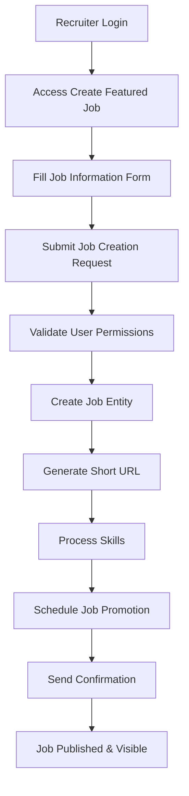

### Detailed Technical Flow
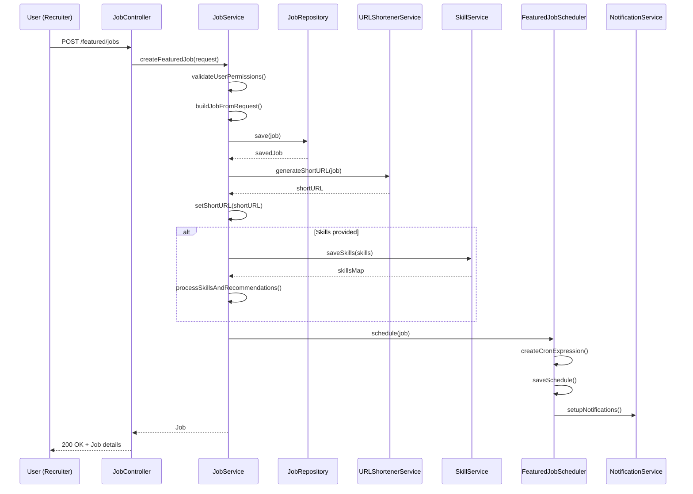

## 2. Apply to a Featured Job Flow

### High-Level Process Flow
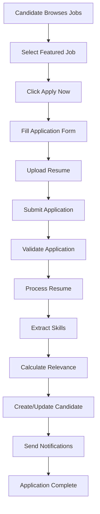

### Detailed Technical Flow
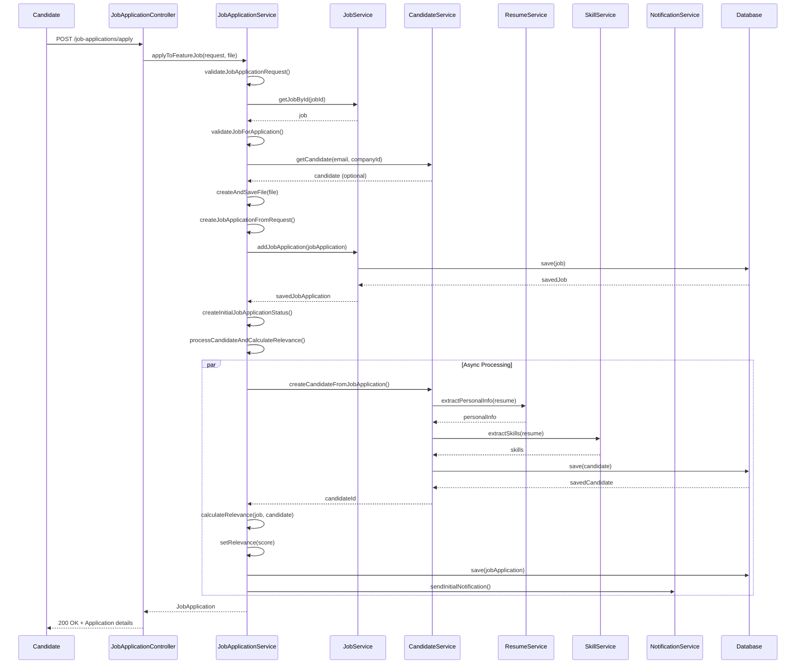

## 3. Candidate Skill Extraction Flow

### High-Level Process Flow
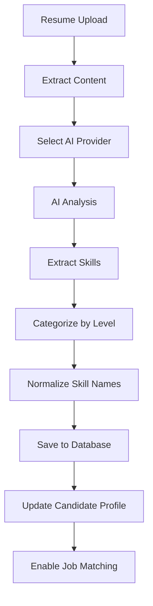

### Detailed Technical Flow
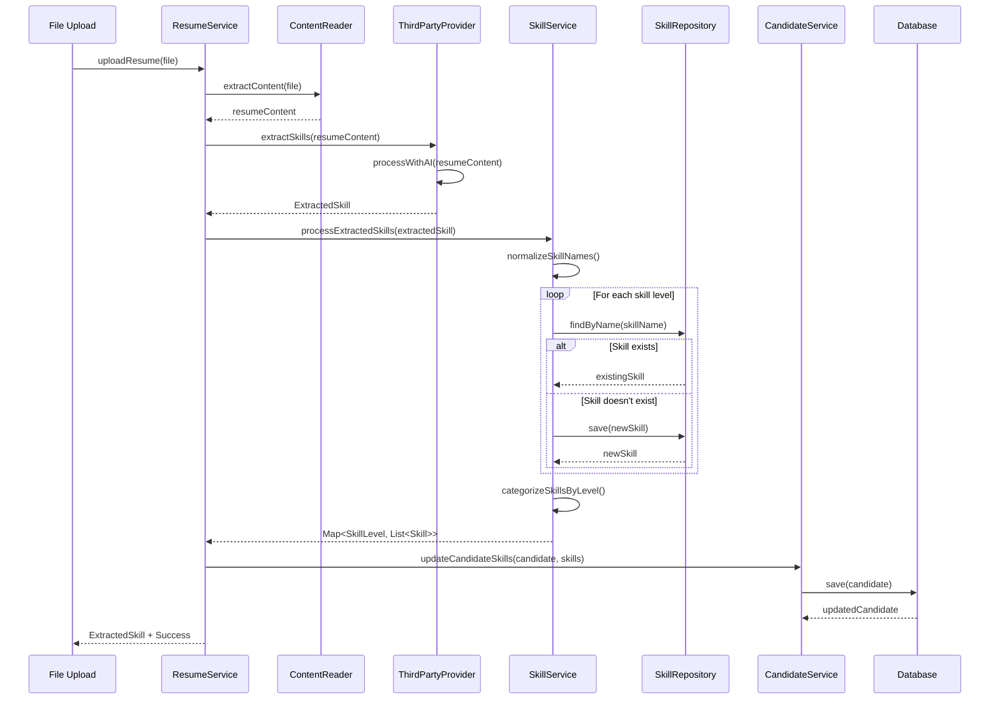

### AI Provider Selection Flow
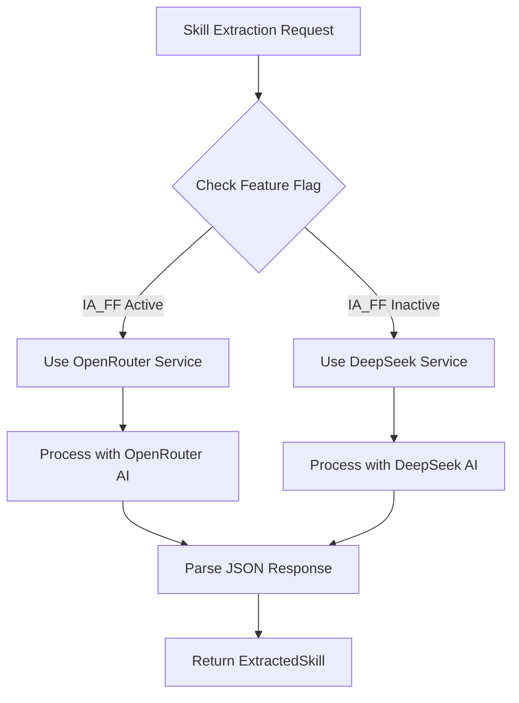

## 4. Resume Improvement Flow

### High-Level Process Flow
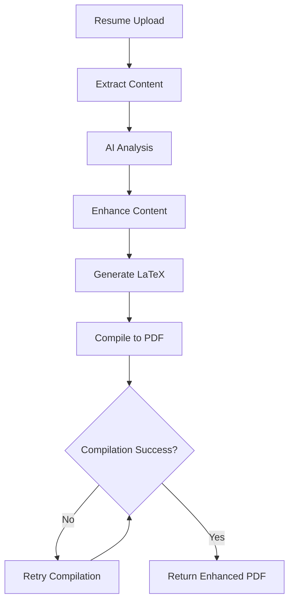

### Detailed Technical Flow
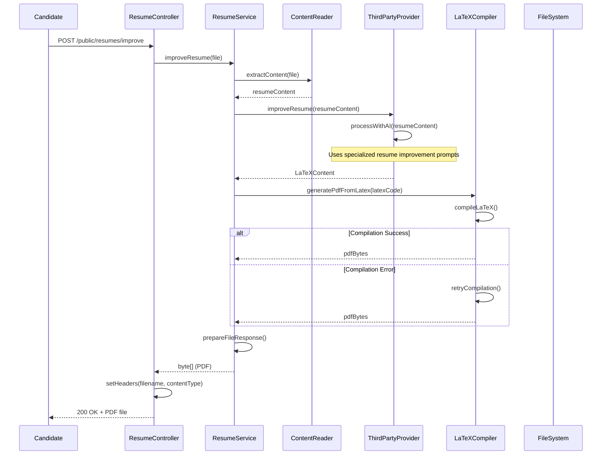

### Resume Enhancement Process
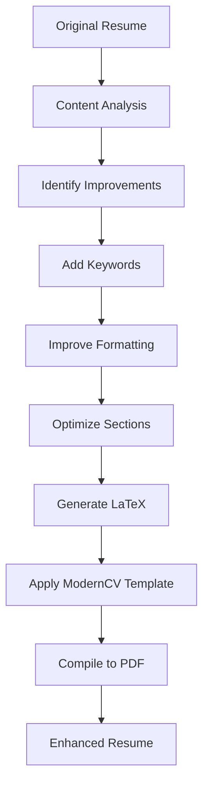

## 5. System Architecture Overview

### Component Interaction Diagram
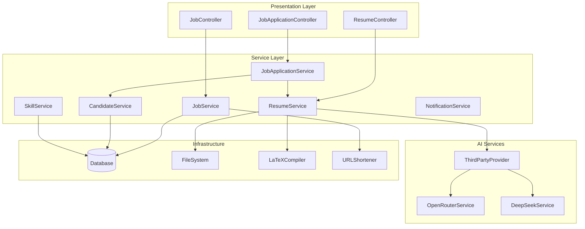

## 6. Data Flow Summary

### Entity Relationships
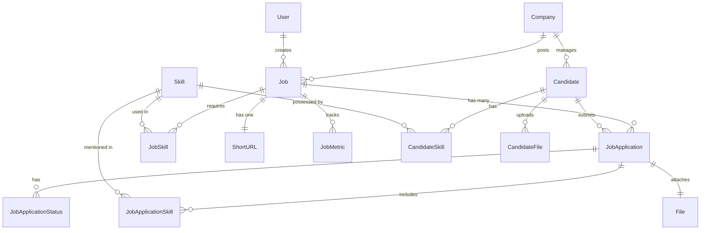

These diagrams provide a comprehensive visual representation of the four main flows in the Job Posting Application, showing both high-level processes and detailed technical interactions between components.
