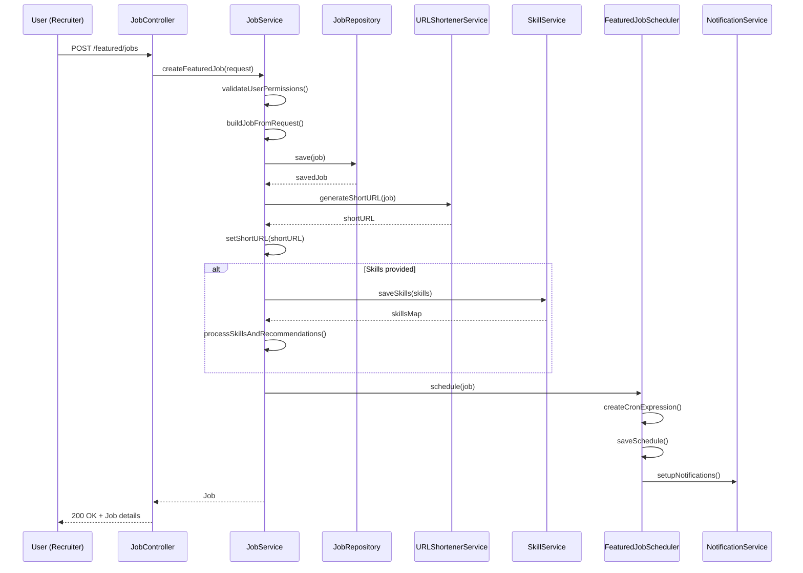
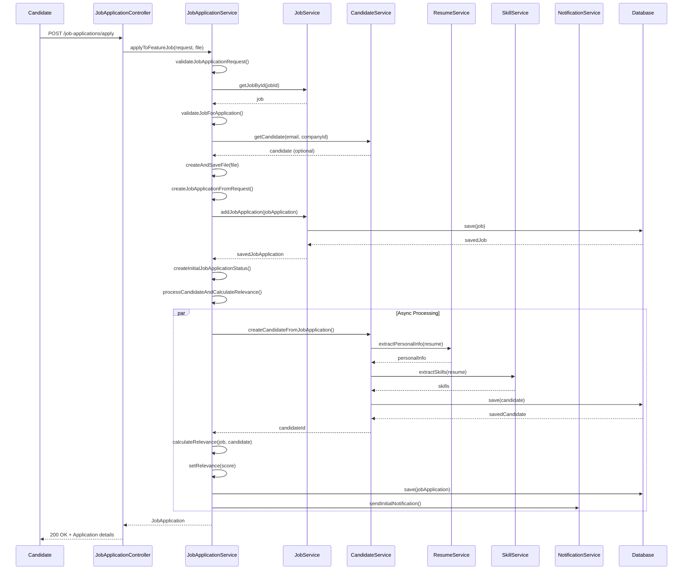
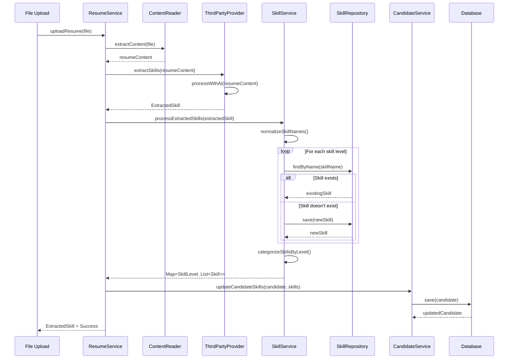
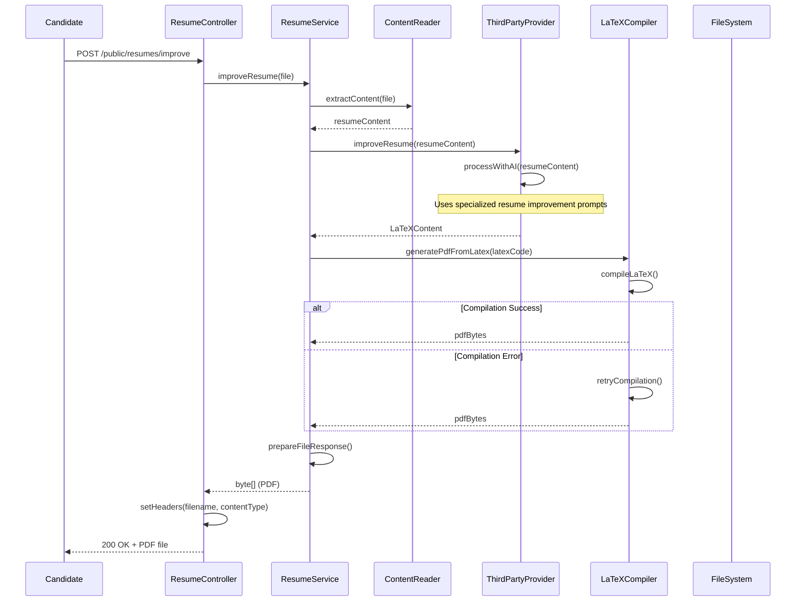

# Job Posting Application - Flow Documentation

This document provides detailed scenarios and diagrams for the four main flows in the Job Posting Application.

## Table of Contents
1. [Add a Featured Job](#add-a-featured-job)
2. [Apply to a Featured Job](#apply-to-a-featured-job)
3. [Candidate Skill Extraction](#candidate-skill-extraction)
4. [Resume Improvement](#resume-improvement)

---

## Add a Featured Job

### Overview
The "Add a Featured Job" flow allows authorized users (ADMIN, REFERRER, COMPANY_ADMIN, COMPANY_RECRUITER) to create and manage featured job postings that receive special visibility and automated promotion.

### Scenario: Creating a New Featured Job

**Actor:** Company Recruiter (Sarah)
**Goal:** Create a featured job posting for a Senior Java Developer position

#### Step-by-Step Process:

1. **Authentication & Authorization**
   - Sarah logs in with her company recruiter credentials
   - System validates her role has permission to create featured jobs
   - Sarah navigates to the "Create Featured Job" interface

2. **Job Information Input**
   - Sarah fills out the job creation form with:
     - Job title: "Senior Java Developer"
     - Description: Detailed job requirements and responsibilities
     - Location: "San Francisco, CA"
     - Category: "Software Development"
     - Sub-category: "Backend Development"
     - Salary range: $120,000 - $150,000 USD
     - Required skills: Java, Spring Boot, Microservices, AWS
     - Client information (if applicable)

3. **System Processing**
   - System validates all required fields
   - Creates a new Job entity with `featured = true`
   - Generates a unique short URL for the job posting
   - Processes and saves skills with appropriate skill levels
   - Associates the job with Sarah's company

4. **Job Scheduling**
   - System automatically schedules the job for promotion
   - Creates a FeaturedJobSchedule entry with cron expression
   - Sets up automated notifications via WhatsApp and Telegram
   - Job is marked as published and visible to candidates

5. **Confirmation**
   - Sarah receives confirmation of successful job creation
   - Job appears in the featured jobs list
   - Short URL is generated for easy sharing

### Technical Flow Diagram

### Key Components

- **JobController**: Handles HTTP requests for job operations
- **JobService**: Business logic for job creation and management
- **FeaturedJobScheduler**: Manages automated job promotion scheduling
- **SkillService**: Processes and categorizes job skills
- **URLShortenerService**: Generates short URLs for job postings

---

## Apply to a Featured Job

### Overview
The "Apply to a Featured Job" flow enables candidates to submit applications for featured job positions, including resume upload, skill extraction, and relevance scoring.

### Scenario: Candidate Application Process

**Actor:** Job Candidate (John)
**Goal:** Apply for a Senior Java Developer position

#### Step-by-Step Process:

1. **Job Discovery**
   - John browses featured jobs on the platform
   - Finds the "Senior Java Developer" position
   - Reviews job details, requirements, and salary range
   - Clicks "Apply Now" button

2. **Application Form Submission**
   - John fills out the application form with:
     - Personal information (name, email, phone)
     - Expected salary: $130,000
     - Uploads his resume (PDF format)
     - Selects notification preferences (email, WhatsApp)
     - Provides additional information if required

3. **System Processing**
   - System validates the application data
   - Checks for duplicate applications from the same email
   - Validates that the job is still open and accepting applications
   - Saves the job application with initial status

4. **Resume Processing & Skill Extraction**
   - System extracts text content from the uploaded resume
   - Uses AI services (OpenRouter/DeepSeek) to analyze the resume
   - Extracts technical skills and categorizes them by proficiency level
   - Creates or updates candidate profile with extracted information

5. **Relevance Calculation**
   - System compares candidate skills against job requirements
   - Calculates skill match percentage
   - Evaluates salary expectations against job salary range
   - Generates overall relevance score (0.0 - 1.0)

6. **Candidate Profile Creation**
   - If new candidate: Creates new Candidate entity
   - If existing candidate: Updates existing profile
   - Associates candidate with the company
   - Links resume file to candidate profile

7. **Notification & Status Update**
   - Creates initial job application status (RECEIVED)
   - Sends confirmation email to candidate
   - Notifies recruiter of new application
   - Application becomes visible in recruiter dashboard

### Technical Flow Diagram

### Key Components

- **JobApplicationController**: Handles application submission requests
- **JobApplicationService**: Manages application processing logic
- **ResumeService**: Handles resume analysis and content extraction
- **CandidateService**: Manages candidate profile operations
- **SkillService**: Processes skill extraction and matching

---

## Candidate Skill Extraction

### Overview
The "Candidate Skill Extraction" flow uses AI-powered analysis to automatically extract and categorize technical skills from candidate resumes, enabling better job matching and candidate evaluation.

### Scenario: Automated Skill Extraction

**Actor:** System (AI Service)
**Goal:** Extract and categorize skills from a candidate's resume

#### Step-by-Step Process:

1. **Resume Upload & Content Extraction**
   - Candidate uploads resume (PDF, DOC, DOCX formats)
   - System extracts raw text content from the document
   - Content is cleaned and prepared for AI analysis
   - File metadata is stored for future reference

2. **AI Service Selection**
   - System checks feature flags to determine AI provider
   - Available providers: OpenRouter, DeepSeek
   - Selected provider processes the resume content

3. **Skill Analysis & Extraction**
   - AI service analyzes resume content using specialized prompts
   - Identifies technical skills, programming languages, frameworks
   - Categorizes skills by proficiency level:
     - Beginner
     - Intermediate  
     - Advanced
     - Expert
   - Extracts additional skills not explicitly categorized

4. **Skill Normalization & Validation**
   - System normalizes skill names (e.g., "Java" vs "JAVA" vs "java")
   - Checks against existing skill database
   - Creates new skills if they don't exist
   - Assigns appropriate skill levels based on context

5. **Candidate Profile Update**
   - Skills are associated with the candidate profile
   - Skill levels are stored with timestamps
   - Candidate profile is updated with extracted information
   - Skills are linked to job applications for relevance scoring

6. **Job Matching Preparation**
   - Extracted skills are used for job matching algorithms
   - Skills are compared against job requirements
   - Relevance scores are calculated for potential matches
   - Candidate becomes searchable by skill criteria

### Technical Flow Diagram

### AI Service Integration

The system supports multiple AI providers for skill extraction:

#### OpenRouter Service
- Uses advanced language models via OpenRouter API
- Specialized prompts for technical skill extraction
- JSON response parsing for structured data
- Retry logic for API failures

#### DeepSeek Service  
- Alternative AI provider for skill extraction
- Similar functionality to OpenRouter
- Fallback option for improved reliability
- Feature flag controlled activation

### Key Components

- **ResumeService**: Orchestrates the skill extraction process
- **ThirdPartyProvider**: Interface for AI service integration
- **ContentReader**: Handles document content extraction
- **SkillService**: Manages skill processing and storage
- **SkillRepository**: Database operations for skills

---

## Resume Improvement

### Overview
The "Resume Improvement" flow uses AI to enhance candidate resumes, making them more ATS-compliant and professionally formatted while preserving all original content.

### Scenario: AI-Powered Resume Enhancement

**Actor:** Job Candidate (Maria)
**Goal:** Improve her resume to be more ATS-compliant and professional

#### Step-by-Step Process:

1. **Resume Upload**
   - Maria uploads her current resume (PDF format)
   - System validates file format and size
   - File is temporarily stored for processing

2. **Content Extraction & Analysis**
   - System extracts all text content from the resume
   - AI analyzes the resume structure and content
   - Identifies areas for improvement:
     - Missing keywords
     - Poor formatting
     - Unclear sections
     - Missing achievements

3. **AI-Powered Enhancement**
   - AI service processes the resume using specialized prompts
   - Enhances content while preserving all original information
   - Improves formatting and structure
   - Adds relevant keywords for ATS compatibility
   - Optimizes section headings and organization

4. **LaTeX Generation**
   - AI generates LaTeX code for the improved resume
   - Uses moderncv template for professional appearance
   - Includes proper LaTeX syntax and formatting
   - Ensures complete document structure

5. **PDF Compilation**
   - System compiles LaTeX code to generate PDF
   - Handles compilation errors with retry logic
   - Ensures proper font sizing and layout
   - Generates high-quality output document

6. **File Delivery**
   - Enhanced resume is compiled to PDF format
   - File is prepared for download with proper naming
   - Maria receives the improved resume
   - Original file is preserved for reference

### Technical Flow Diagram

### AI Enhancement Features

The resume improvement process includes:

#### Content Enhancement
- **ATS Optimization**: Ensures compatibility with Applicant Tracking Systems
- **Keyword Integration**: Adds relevant industry keywords
- **Achievement Quantification**: Helps quantify accomplishments
- **Section Optimization**: Improves section headings and organization

#### Formatting Improvements
- **Professional Layout**: Uses moderncv LaTeX template
- **Consistent Styling**: Ensures uniform formatting throughout
- **Readable Typography**: Optimizes font sizes and spacing
- **Clean Structure**: Removes graphics and complex layouts for ATS compatibility

#### LaTeX Template Features
- **Modern Design**: Professional appearance with clean lines
- **Customizable Headers**: Proper font sizing for name and title
- **Section Organization**: Clear separation of resume sections
- **Print-Ready Output**: High-quality PDF generation

### Key Components

- **ResumeController**: Handles resume improvement requests
- **ResumeService**: Manages the improvement process
- **ThirdPartyProvider**: AI service integration for content enhancement
- **LaTeXCompiler**: Handles LaTeX to PDF conversion
- **ContentReader**: Extracts text from uploaded documents

---

## Summary

These four flows represent the core functionality of the Job Posting Application:

1. **Add a Featured Job**: Enables recruiters to create and manage premium job postings with automated promotion
2. **Apply to a Featured Job**: Allows candidates to submit applications with automated skill extraction and relevance scoring
3. **Candidate Skill Extraction**: Uses AI to automatically analyze and categorize candidate skills from resumes
4. **Resume Improvement**: Leverages AI to enhance candidate resumes for better ATS compatibility and professional appearance

Each flow is designed to be robust, scalable, and user-friendly, with proper error handling, validation, and notification systems to ensure a smooth user experience.
