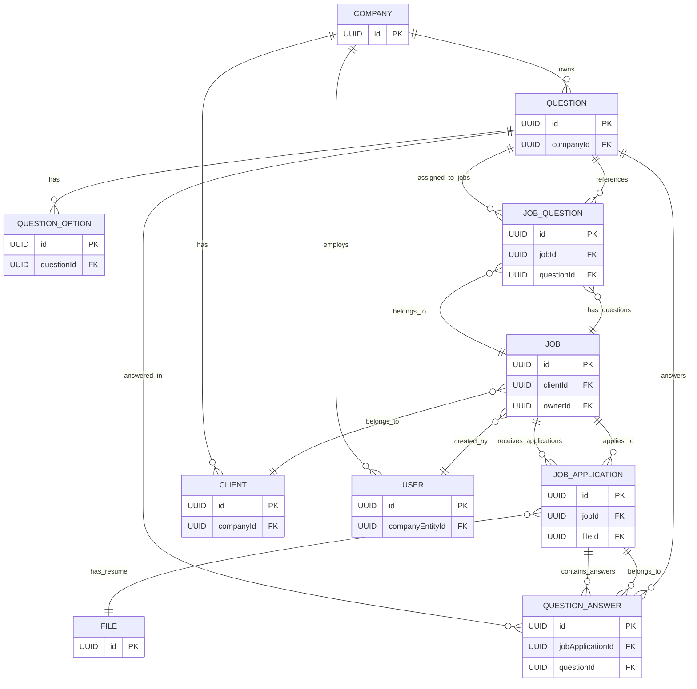
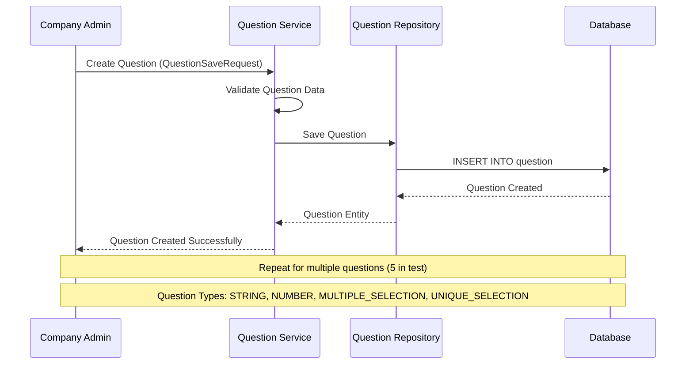
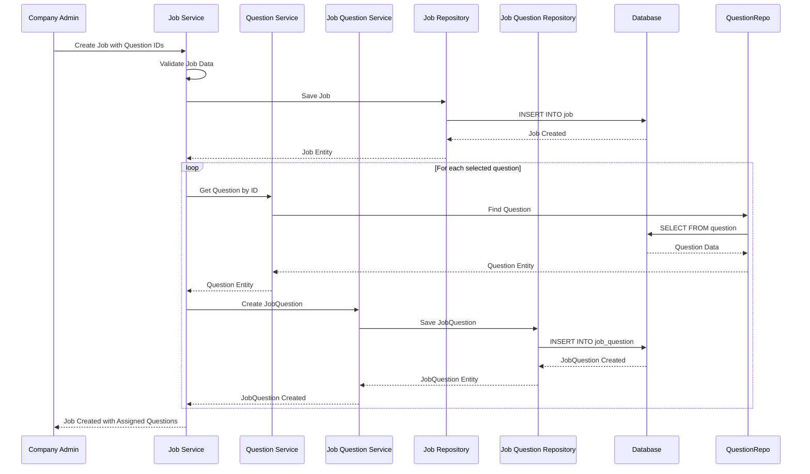
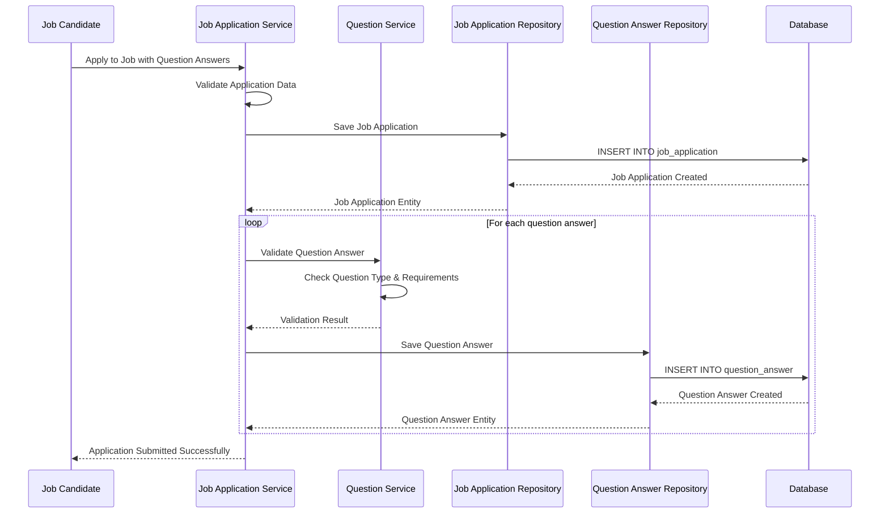
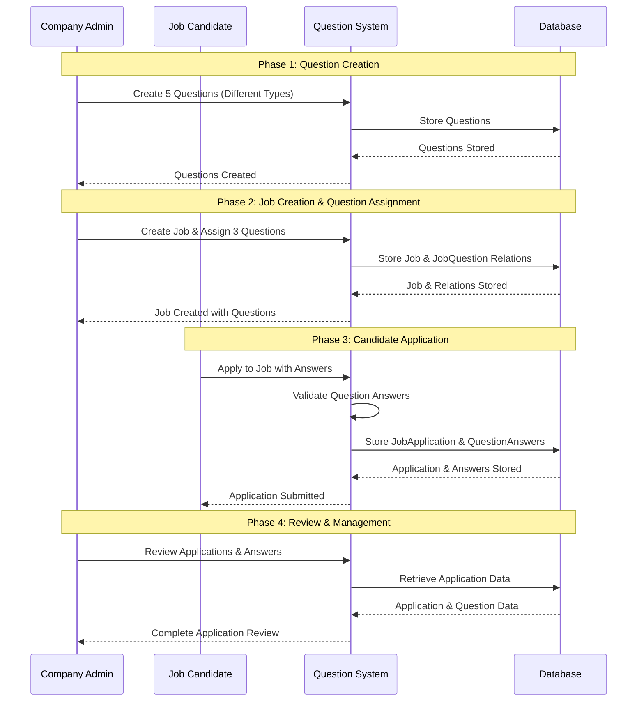
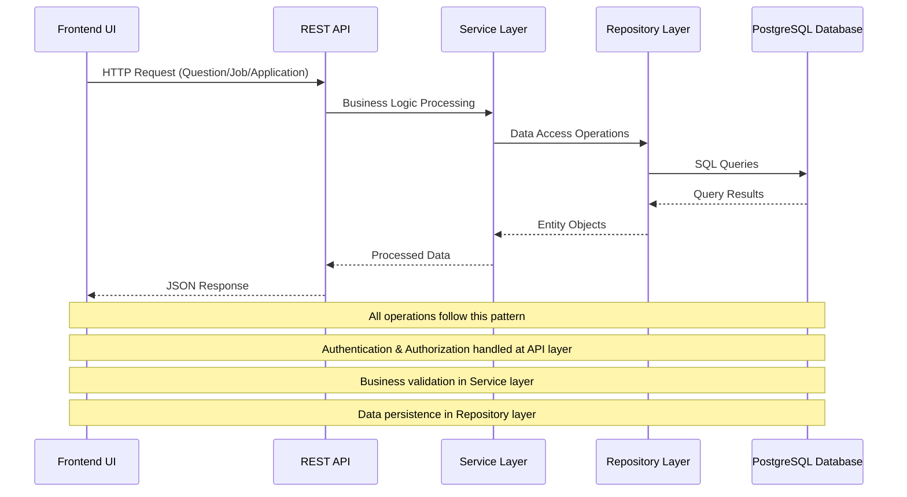

# Question Workflow and UI Design Documentation

## Table of Contents
1. [Question Workflow Deep Dive](#question-workflow-deep-dive)
2. [Backend Architecture](#backend-architecture)
3. [React Component Mockups](#react-component-mockups)
4. [Question System Workflow](#question-system-workflow)
5. [API Endpoints Documentation](#api-endpoints-documentation)
6. [Implementation Guidelines](#implementation-guidelines)

---

## Question Workflow Deep Dive

### Overview
The question system allows companies to create custom questionnaires for job applications, enabling them to gather specific information from candidates beyond the standard application form. The workflow supports multiple question types, dynamic assignment to jobs, and structured answer collection.

### Database Entity Relationship Diagram

The following diagram shows the complete database schema for the question system and its relationships with existing entities:



### Question Types and Usage

| Question Type | Description | Requires Options | Example Usage |
|---------------|-------------|------------------|---------------|
| **STRING** | Free-text answers | No | "Describe your experience with Java" |
| **NUMBER** | Numeric answers | No | "Years of experience", "Expected salary" |
| **MULTIPLE_SELECTION** | Multiple choice with multiple selections allowed | Yes | "Which programming languages do you know?" |
| **UNIQUE_SELECTION** | Single choice from multiple options | Yes | "What is your preferred work arrangement?" |

### Key Relationships Explained

1. **Company → Questions**: Each company can create multiple questions for their job applications
2. **Question → Options**: Choice-based questions (MULTIPLE_SELECTION, UNIQUE_SELECTION) can have multiple predefined options
3. **Job → Questions**: Jobs can be assigned a subset of the company's questions via the JobQuestion junction table
4. **JobApplication → Answers**: When candidates apply, their answers are stored in QuestionAnswer entities
5. **Order Management**: Both JobQuestion and QuestionOption have orderIndex fields to control display order

### Question System Workflow

The question system follows a three-step workflow that allows companies to create custom questionnaires for job applications:

#### 1. Create Questions Database per Company

Company administrators can create a library of questions that can be reused across multiple job postings:

- **Question Types**: Support for different question types (STRING, NUMBER, MULTIPLE_SELECTION, UNIQUE_SELECTION)
- **Question Management**: Create, edit, activate/deactivate questions
- **Question Options**: For choice-based questions, define multiple answer options
- **Company Scope**: All questions are scoped to the company, ensuring data isolation

**Key Features:**
- Question bank management with search and filtering
- Reusable question templates
- Question categorization and organization
- Bulk operations for efficiency

#### 2. Create a Job and Choose Questions

When creating a job posting, administrators can select which questions from the company's question bank should be included:

- **Question Selection**: Choose from available company questions
- **Question Ordering**: Define the order in which questions appear to candidates
- **Job-Specific Configuration**: Each job can have a different set of questions
- **Preview Mode**: See how questions will appear to candidates before publishing

**Key Features:**
- Drag-and-drop question ordering
- Question preview functionality
- Flexible question assignment per job
- Template-based job creation

#### 3. Candidate Application with Question Answers

When candidates apply for a job, they answer the assigned questions and their responses are linked to their job application:

- **Dynamic Form Generation**: Questions are rendered based on their type and configuration
- **Answer Collection**: Structured collection of candidate responses
- **Answer Validation**: Real-time validation for required questions
- **Answer Storage**: All answers are stored and linked to the specific job application

**Key Features:**
- Progressive form completion with save draft functionality
- Mobile-optimized question interfaces
- Real-time validation and error handling
- Answer review and management for recruiters

#### Workflow Benefits

- **Flexibility**: Each job can have a unique set of questions
- **Reusability**: Questions can be reused across multiple jobs
- **Scalability**: Easy to manage large question banks
- **Consistency**: Standardized question format across all applications
- **Analytics**: Collect structured data for better hiring decisions

### Sequence Diagrams

The following sequence diagrams illustrate the complete question workflow based on the integration test `completeQuestionWorkflow_ShouldWorkEndToEnd`:

#### 1. Question Creation Workflow



#### 2. Job Creation with Question Assignment



#### 3. Candidate Application with Question Answers



#### 4. Complete End-to-End Workflow



#### 5. Data Flow Architecture



---

## Backend Architecture

### API Endpoints

#### Question Management APIs
```http
GET    /api/questions                    # Get all company questions
POST   /api/questions                    # Create new question
PUT    /api/questions/{id}               # Update question
DELETE /api/questions/{id}               # Delete question
GET    /api/questions/types              # Get available question types
POST   /api/questions/reorder            # Reorder questions
```

#### Job-Question Assignment APIs
```http
GET    /api/jobs/{id}/questions          # Get questions assigned to job
POST   /api/jobs/{id}/questions          # Assign questions to job
DELETE /api/jobs/{id}/questions/{questionId}  # Remove question from job
POST   /api/jobs/{id}/questions/reorder  # Reorder questions in job
```

#### Application APIs (Enhanced)
```http
POST   /api/jobs/{id}/apply              # Apply to job with question answers
GET    /api/applications/{id}/answers    # Get answers for application
```

---


## React Component Mockups

### 1. Question Management Dashboard

```jsx
// QuestionBankDashboard.jsx
import React, { useState } from 'react';
import { QuestionCard, QuestionForm, QuestionTypeSelector } from './components';

const QuestionBankDashboard = () => {
  const [questions, setQuestions] = useState([]);
  const [showCreateForm, setShowCreateForm] = useState(false);

  return (
    <div className="question-bank-dashboard">
      <div className="dashboard-header">
        <h1>Question Bank</h1>
        <button 
          className="btn btn-primary"
          onClick={() => setShowCreateForm(true)}
        >
          Create New Question
        </button>
      </div>

      <div className="question-filters">
        <QuestionTypeFilter />
        <StatusFilter />
        <SearchBar placeholder="Search questions..." />
      </div>

      <div className="questions-grid">
        {questions.map(question => (
          <QuestionCard 
            key={question.id}
            question={question}
            onEdit={handleEdit}
            onDelete={handleDelete}
            onReorder={handleReorder}
          />
        ))}
      </div>

      {showCreateForm && (
        <QuestionForm 
          onSave={handleCreateQuestion}
          onCancel={() => setShowCreateForm(false)}
        />
      )}
    </div>
  );
};
```

### 2. Question Creation Form

```jsx
// QuestionForm.jsx
import React, { useState } from 'react';

const QuestionForm = ({ question, onSave, onCancel }) => {
  const [formData, setFormData] = useState({
    questionText: question?.questionText || '',
    questionType: question?.questionType || 'STRING',
    required: question?.required || false,
    active: question?.active || true,
    options: question?.options || []
  });

  const questionTypes = [
    { value: 'STRING', label: 'Text Answer', icon: '📝' },
    { value: 'NUMBER', label: 'Number', icon: '🔢' },
    { value: 'MULTIPLE_SELECTION', label: 'Multiple Choice', icon: '☑️' },
    { value: 'UNIQUE_SELECTION', label: 'Single Choice', icon: '🔘' }
  ];

  return (
    <div className="question-form-modal">
      <div className="modal-header">
        <h2>{question ? 'Edit Question' : 'Create New Question'}</h2>
      </div>

      <form onSubmit={handleSubmit} className="question-form">
        <div className="form-group">
          <label htmlFor="questionText">Question Text *</label>
          <textarea
            id="questionText"
            value={formData.questionText}
            onChange={(e) => setFormData({...formData, questionText: e.target.value})}
            placeholder="Enter your question here..."
            rows={3}
            required
          />
        </div>

        <div className="form-group">
          <label>Question Type *</label>
          <div className="question-type-selector">
            {questionTypes.map(type => (
              <div 
                key={type.value}
                className={`type-option ${formData.questionType === type.value ? 'selected' : ''}`}
                onClick={() => setFormData({...formData, questionType: type.value})}
              >
                <span className="type-icon">{type.icon}</span>
                <span className="type-label">{type.label}</span>
              </div>
            ))}
          </div>
        </div>

        {(formData.questionType === 'MULTIPLE_SELECTION' || 
          formData.questionType === 'UNIQUE_SELECTION') && (
          <div className="form-group">
            <label>Answer Options</label>
            <OptionsEditor 
              options={formData.options}
              onChange={(options) => setFormData({...formData, options})}
            />
          </div>
        )}

        <div className="form-group checkbox-group">
          <label className="checkbox-label">
            <input
              type="checkbox"
              checked={formData.required}
              onChange={(e) => setFormData({...formData, required: e.target.checked})}
            />
            <span className="checkmark"></span>
            Required Question
          </label>
        </div>

        <div className="form-group checkbox-group">
          <label className="checkbox-label">
            <input
              type="checkbox"
              checked={formData.active}
              onChange={(e) => setFormData({...formData, active: e.target.checked})}
            />
            <span className="checkmark"></span>
            Active
          </label>
        </div>

        <div className="form-actions">
          <button type="button" onClick={onCancel} className="btn btn-secondary">
            Cancel
          </button>
          <button type="submit" className="btn btn-primary">
            {question ? 'Update Question' : 'Create Question'}
          </button>
        </div>
      </form>
    </div>
  );
};
```

### 3. Job Creation with Question Assignment

```jsx
// JobCreationWithQuestions.jsx
import React, { useState, useEffect } from 'react';
import { QuestionSelector, QuestionPreview } from './components';

const JobCreationWithQuestions = ({ onJobCreate }) => {
  const [jobData, setJobData] = useState({
    name: '',
    description: '',
    category: '',
    // ... other job fields
    questionIds: []
  });
  const [availableQuestions, setAvailableQuestions] = useState([]);
  const [selectedQuestions, setSelectedQuestions] = useState([]);

  return (
    <div className="job-creation-form">
      <div className="form-section">
        <h2>Job Details</h2>
        {/* Standard job form fields */}
        <JobBasicInfo 
          data={jobData}
          onChange={setJobData}
        />
      </div>

      <div className="form-section">
        <h2>Application Questions</h2>
        <p className="section-description">
          Select questions from your question bank to include in this job application.
        </p>

        <div className="question-assignment-container">
          <div className="available-questions">
            <h3>Available Questions</h3>
            <div className="question-filters">
              <QuestionTypeFilter />
              <SearchBar />
            </div>
            <QuestionList
              questions={availableQuestions}
              selectedIds={jobData.questionIds}
              onSelect={handleQuestionSelect}
              onDeselect={handleQuestionDeselect}
            />
          </div>

          <div className="selected-questions">
            <h3>Selected Questions ({selectedQuestions.length})</h3>
            <DraggableQuestionList
              questions={selectedQuestions}
              onReorder={handleQuestionReorder}
              onRemove={handleQuestionRemove}
            />
          </div>
        </div>

        <div className="question-preview">
          <h3>Preview</h3>
          <QuestionPreview questions={selectedQuestions} />
        </div>
      </div>

      <div className="form-actions">
        <button onClick={handleSaveDraft} className="btn btn-secondary">
          Save Draft
        </button>
        <button onClick={handlePublishJob} className="btn btn-primary">
          Publish Job
        </button>
      </div>
    </div>
  );
};
```

### 4. Candidate Application Form

```jsx
// JobApplicationForm.jsx
import React, { useState, useEffect } from 'react';
import { ProgressBar, QuestionInput } from './components';

const JobApplicationForm = ({ job, onSubmit }) => {
  const [currentStep, setCurrentStep] = useState(0);
  const [formData, setFormData] = useState({
    personalInfo: {},
    questionAnswers: {}
  });

  const steps = [
    { id: 'personal', title: 'Personal Information' },
    { id: 'resume', title: 'Resume Upload' },
    { id: 'questions', title: 'Application Questions' },
    { id: 'review', title: 'Review & Submit' }
  ];

  const totalSteps = steps.length;
  const progress = ((currentStep + 1) / totalSteps) * 100;

  return (
    <div className="job-application-form">
      <div className="application-header">
        <h1>{job.name}</h1>
        <div className="company-info">
          <span>{job.company}</span>
          <span>•</span>
          <span>{job.location}</span>
        </div>
      </div>

      <ProgressBar progress={progress} steps={steps} currentStep={currentStep} />

      <div className="form-content">
        {currentStep === 0 && (
          <PersonalInfoStep 
            data={formData.personalInfo}
            onChange={(data) => setFormData({...formData, personalInfo: data})}
            onNext={() => setCurrentStep(1)}
          />
        )}

        {currentStep === 1 && (
          <ResumeUploadStep 
            onUpload={handleResumeUpload}
            onNext={() => setCurrentStep(2)}
            onBack={() => setCurrentStep(0)}
          />
        )}

        {currentStep === 2 && (
          <QuestionsStep 
            questions={job.assignedQuestions}
            answers={formData.questionAnswers}
            onChange={(answers) => setFormData({...formData, questionAnswers: answers})}
            onNext={() => setCurrentStep(3)}
            onBack={() => setCurrentStep(1)}
          />
        )}

        {currentStep === 3 && (
          <ReviewStep 
            job={job}
            formData={formData}
            onSubmit={handleSubmit}
            onBack={() => setCurrentStep(2)}
          />
        )}
      </div>
    </div>
  );
};
```

### 5. Question Input Components

```jsx
// QuestionInput.jsx
import React from 'react';

const QuestionInput = ({ question, value, onChange, error }) => {
  const renderInput = () => {
    switch (question.questionType) {
      case 'STRING':
        return (
          <textarea
            value={value}
            onChange={(e) => onChange(e.target.value)}
            placeholder="Enter your answer..."
            rows={4}
            className={`form-control ${error ? 'error' : ''}`}
          />
        );

      case 'NUMBER':
        return (
          <input
            type="number"
            value={value}
            onChange={(e) => onChange(e.target.value)}
            placeholder="Enter a number..."
            className={`form-control ${error ? 'error' : ''}`}
          />
        );

      case 'MULTIPLE_SELECTION':
        return (
          <div className="checkbox-group">
            {question.options.map(option => (
              <label key={option.id} className="checkbox-option">
                <input
                  type="checkbox"
                  checked={value?.includes(option.id) || false}
                  onChange={(e) => handleMultipleSelection(option.id, e.target.checked)}
                />
                <span className="checkmark"></span>
                {option.text}
              </label>
            ))}
          </div>
        );

      case 'UNIQUE_SELECTION':
        return (
          <div className="radio-group">
            {question.options.map(option => (
              <label key={option.id} className="radio-option">
                <input
                  type="radio"
                  name={`question_${question.id}`}
                  value={option.id}
                  checked={value === option.id}
                  onChange={(e) => onChange(e.target.value)}
                />
                <span className="radio-mark"></span>
                {option.text}
              </label>
            ))}
          </div>
        );

      default:
        return <div>Unsupported question type</div>;
    }
  };

  return (
    <div className="question-input">
      <div className="question-header">
        <h3 className="question-text">{question.questionText}</h3>
        {question.required && <span className="required-indicator">*</span>}
      </div>
      
      {renderInput()}
      
      {error && <div className="error-message">{error}</div>}
    </div>
  );
};
```

### 6. Application Review Dashboard

```jsx
// ApplicationReviewDashboard.jsx
import React, { useState } from 'react';
import { ApplicationCard, AnswerViewer, FilterPanel } from './components';

const ApplicationReviewDashboard = ({ job }) => {
  const [applications, setApplications] = useState([]);
  const [selectedApplication, setSelectedApplication] = useState(null);
  const [filters, setFilters] = useState({});

  return (
    <div className="application-review-dashboard">
      <div className="dashboard-header">
        <h1>Applications for {job.name}</h1>
        <div className="application-stats">
          <span className="stat">
            <strong>{applications.length}</strong> Total Applications
          </span>
          <span className="stat">
            <strong>{applications.filter(app => app.status === 'NEW').length}</strong> New
          </span>
        </div>
      </div>

      <div className="dashboard-content">
        <div className="applications-list">
          <FilterPanel 
            filters={filters}
            onChange={setFilters}
            questions={job.assignedQuestions}
          />
          
          <div className="applications-grid">
            {applications.map(application => (
              <ApplicationCard
                key={application.id}
                application={application}
                onClick={() => setSelectedApplication(application)}
                isSelected={selectedApplication?.id === application.id}
              />
            ))}
          </div>
        </div>

        {selectedApplication && (
          <div className="application-details">
            <ApplicationDetailsView 
              application={selectedApplication}
              questions={job.assignedQuestions}
              onStatusChange={handleStatusChange}
            />
          </div>
        )}
      </div>
    </div>
  );
};
```

---

## API Endpoints Documentation

This section provides detailed information about all API endpoints related to the question system, including request/response examples and authentication requirements.

### Authentication
All endpoints require authentication via Bearer token in the Authorization header:
```
Authorization: Bearer <your-jwt-token>
```

### Base URL
```
https://api-dev.itjobopportunities.io/
```

---

### Question Management Endpoints

#### 1. Get All Questions for Company
**Endpoint:** `GET /questions`
**Description:** Retrieves all questions belonging to the authenticated user's company

**Query Parameters:**
- `page` (optional): Page number (default: 0)
- `size` (optional): Page size (default: 20)
- `sort` (optional): Sort field (default: createdDate,asc)
- `active` (optional): Filter by active status (true/false)

**Response:**
```json
{
  "content": [
    {
      "id": "123e4567-e89b-12d3-a456-426614174000",
      "questionText": "How many years of experience do you have with Java?",
      "required": true,
      "active": true,
      "questionType": "NUMBER",
      "companyId": "456e7890-e89b-12d3-a456-426614174001",
      "options": [],
      "createdDate": "2025-01-15T10:30:00Z",
      "createdBy": "admin@company.com"
    },
    {
      "id": "789e0123-e89b-12d3-a456-426614174002",
      "questionText": "Which programming languages are you proficient in?",
      "required": true,
      "active": true,
      "questionType": "MULTIPLE_SELECTION",
      "companyId": "456e7890-e89b-12d3-a456-426614174001",
      "options": [
        {
          "id": "111e2222-e89b-12d3-a456-426614174003",
          "optionText": "Java",
          "orderIndex": 1
        },
        {
          "id": "222e3333-e89b-12d3-a456-426614174004",
          "optionText": "Python",
          "orderIndex": 2
        },
        {
          "id": "333e4444-e89b-12d3-a456-426614174005",
          "optionText": "JavaScript",
          "orderIndex": 3
        }
      ],
      "createdDate": "2025-01-15T11:00:00Z",
      "createdBy": "admin@company.com"
    }
  ],
  "pageable": {
    "pageNumber": 0,
    "pageSize": 20,
    "sort": {
      "sorted": true,
      "unsorted": false
    }
  },
  "totalElements": 25,
  "totalPages": 2,
  "first": true,
  "last": false
}
```

#### 2. Create New Question
**Endpoint:** `POST /questions`
**Description:** Creates a new question for the company

**Request Body:**
```json
{
  "questionText": "Describe your experience with microservices architecture",
  "required": true,
  "active": true,
  "questionType": "STRING",
  "options": []
}
```

**Response (201 Created):**
```json
{
  "id": "444e5555-e89b-12d3-a456-426614174006",
  "questionText": "Describe your experience with microservices architecture",
  "required": true,
  "active": true,
  "questionType": "STRING",
  "companyId": "456e7890-e89b-12d3-a456-426614174001",
  "options": [],
  "createdDate": "2025-01-15T12:00:00Z",
  "createdBy": "admin@company.com"
}
```

#### 3. Create Question with Options
**Endpoint:** `POST /questions`
**Description:** Creates a question with predefined options

**Request Body:**
```json
{
  "questionText": "What is your preferred work arrangement?",
  "required": true,
  "active": true,
  "questionType": "UNIQUE_SELECTION",
  "options": [
    {
      "optionText": "Remote",
      "orderIndex": 1
    },
    {
      "optionText": "Hybrid",
      "orderIndex": 2
    },
    {
      "optionText": "On-site",
      "orderIndex": 3
    }
  ]
}
```

**Response (201 Created):**
```json
{
  "id": "555e6666-e89b-12d3-a456-426614174007",
  "questionText": "What is your preferred work arrangement?",
  "required": true,
  "active": true,
  "questionType": "UNIQUE_SELECTION",
  "companyId": "456e7890-e89b-12d3-a456-426614174001",
  "options": [
    {
      "id": "666e7777-e89b-12d3-a456-426614174008",
      "optionText": "Remote",
      "orderIndex": 1
    },
    {
      "id": "777e8888-e89b-12d3-a456-426614174009",
      "optionText": "Hybrid",
      "orderIndex": 2
    },
    {
      "id": "888e9999-e89b-12d3-a456-426614174010",
      "optionText": "On-site",
      "orderIndex": 3
    }
  ],
  "createdDate": "2025-01-15T12:30:00Z",
  "createdBy": "admin@company.com"
}
```

#### 4. Get Question by ID
**Endpoint:** `GET /questions/{questionId}`
**Description:** Retrieves a specific question by its ID

**Path Parameters:**
- `questionId`: UUID of the question

**Response:**
```json
{
  "id": "123e4567-e89b-12d3-a456-426614174000",
  "questionText": "How many years of experience do you have with Java?",
  "required": true,
  "active": true,
  "questionType": "NUMBER",
  "companyId": "456e7890-e89b-12d3-a456-426614174001",
  "options": [],
  "createdDate": "2025-01-15T10:30:00Z",
  "createdBy": "admin@company.com"
}
```

#### 5. Update Question
**Endpoint:** `PUT /questions/{questionId}`
**Description:** Updates an existing question

**Path Parameters:**
- `questionId`: UUID of the question

**Request Body:**
```json
{
  "questionText": "How many years of experience do you have with Java and related frameworks?",
  "required": true,
  "active": true,
  "questionType": "NUMBER",
  "options": []
}
```

**Response:**
```json
{
  "id": "123e4567-e89b-12d3-a456-426614174000",
  "questionText": "How many years of experience do you have with Java and related frameworks?",
  "required": true,
  "active": true,
  "questionType": "NUMBER",
  "companyId": "456e7890-e89b-12d3-a456-426614174001",
  "options": [],
  "createdDate": "2025-01-15T10:30:00Z",
  "createdBy": "admin@company.com"
}
```

#### 6. Delete Question
**Endpoint:** `DELETE /questions/{questionId}`
**Description:** Soft deletes a question (sets active to false)

**Path Parameters:**
- `questionId`: UUID of the question

**Response:** `204 No Content`

#### 7. Get Question Types
**Endpoint:** `GET /questions/types`
**Description:** Returns all available question types

**Response:**
```json
[
  "STRING",
  "NUMBER", 
  "MULTIPLE_SELECTION",
  "UNIQUE_SELECTION"
]
```

---

### Job-Question Assignment Endpoints

#### 8. Create Featured Job with Questions
**Endpoint:** `POST /jobs/featured`
**Description:** Creates a new featured job and assigns specific questions to it

**Request Body:**
```json
{
  "name": "Senior Java Developer",
  "description": "We are looking for an experienced Java developer...",
  "category": "Technology",
  "subCategory": "Software Development",
  "location": "Remote",
  "minSalary": 80000,
  "maxSalary": 120000,
  "currency": "USD",
  "featured": true,
  "questionIds": [
    "123e4567-e89b-12d3-a456-426614174000",
    "789e0123-e89b-12d3-a456-426614174002",
    "555e6666-e89b-12d3-a456-426614174007"
  ]
}
```

**Response (201 Created):**
```json
{
  "id": "999e0000-e89b-12d3-a456-426614174011",
  "name": "Senior Java Developer",
  "description": "We are looking for an experienced Java developer...",
  "category": "Technology",
  "subCategory": "Software Development",
  "location": "Remote",
  "minSalary": 80000,
  "maxSalary": 120000,
  "currency": "USD",
  "featured": true,
  "assignedQuestions": [
    {
      "id": "123e4567-e89b-12d3-a456-426614174000",
      "questionText": "How many years of experience do you have with Java?",
      "required": true,
      "active": true,
      "questionType": "NUMBER",
      "orderIndex": 1,
      "options": []
    },
    {
      "id": "789e0123-e89b-12d3-a456-426614174002",
      "questionText": "Which programming languages are you proficient in?",
      "required": true,
      "active": true,
      "questionType": "MULTIPLE_SELECTION",
      "orderIndex": 2,
      "options": [
        {
          "id": "111e2222-e89b-12d3-a456-426614174003",
          "optionText": "Java",
          "orderIndex": 1
        },
        {
          "id": "222e3333-e89b-12d3-a456-426614174004",
          "optionText": "Python",
          "orderIndex": 2
        }
      ]
    }
  ],
  "createdDate": "2025-01-15T13:00:00Z",
  "createdBy": "admin@company.com"
}
```

#### 9. Update Job Questions
**Endpoint:** `PUT /jobs/{jobId}/questions`
**Description:** Updates the questions assigned to a job

**Path Parameters:**
- `jobId`: UUID of the job

**Request Body:**
```json
{
  "questionIds": [
    "123e4567-e89b-12d3-a456-426614174000",
    "555e6666-e89b-12d3-a456-426614174007"
  ]
}
```

**Response:**
```json
{
  "message": "Job questions updated successfully",
  "assignedQuestionsCount": 2
}
```

---

### Job Application Endpoints

#### 10. Apply to Featured Job with Questions
**Endpoint:** `POST /jobs/{jobId}/apply`
**Description:** Submits a job application with questionnaire answers

**Path Parameters:**
- `jobId`: UUID of the job

**Request Body (multipart/form-data):**
```
firstname: "John"
lastname: "Doe"
email: "john.doe@example.com"
phoneNumber: "+1234567890"
websiteURL: "https://johndoe.dev"
whatsappNotification: true
emailNotification: true
expectedSalary: 95000
currency: "USD"
questionAnswers: [
  {
    "questionId": "123e4567-e89b-12d3-a456-426614174000",
    "answerText": "5",
    "selectedOptionIds": []
  },
  {
    "questionId": "789e0123-e89b-12d3-a456-426614174002", 
    "answerText": "",
    "selectedOptionIds": [
      "111e2222-e89b-12d3-a456-426614174003",
      "222e3333-e89b-12d3-a456-426614174004"
    ]
  }
]
file: [resume.pdf file]
```

**Response (201 Created):**
```json
{
  "id": "000e1111-e89b-12d3-a456-426614174012",
  "firstname": "John",
  "lastname": "Doe",
  "fullname": "John Doe",
  "email": "john.doe@example.com",
  "phoneNumber": "+1234567890",
  "websiteURL": "https://johndoe.dev",
  "expectedSalary": 95000,
  "currency": "USD",
  "jobId": "999e0000-e89b-12d3-a456-426614174011",
  "questionAnswers": [
    {
      "id": "111e2222-e89b-12d3-a456-426614174013",
      "questionId": "123e4567-e89b-12d3-a456-426614174000",
      "questionText": "How many years of experience do you have with Java?",
      "answerText": "5",
      "selectedOptionIds": [],
      "createdDate": "2025-01-15T14:00:00Z"
    },
    {
      "id": "222e3333-e89b-12d3-a456-426614174014",
      "questionId": "789e0123-e89b-12d3-a456-426614174002",
      "questionText": "Which programming languages are you proficient in?",
      "answerText": "",
      "selectedOptionIds": [
        "111e2222-e89b-12d3-a456-426614174003",
        "222e3333-e89b-12d3-a456-426614174004"
      ],
      "createdDate": "2025-01-15T14:00:00Z"
    }
  ],
  "createdDate": "2025-01-15T14:00:00Z",
  "status": "RECEIVED"
}
```

#### 11. Get Job Applications with Question Answers
**Endpoint:** `GET /jobs/{jobId}/applications`
**Description:** Retrieves all applications for a job with their question answers

**Path Parameters:**
- `jobId`: UUID of the job

**Query Parameters:**
- `page` (optional): Page number (default: 0)
- `size` (optional): Page size (default: 20)

**Response:**
```json
{
  "content": [
    {
      "id": "000e1111-e89b-12d3-a456-426614174012",
      "firstname": "John",
      "lastname": "Doe",
      "fullname": "John Doe",
      "email": "john.doe@example.com",
      "phoneNumber": "+1234567890",
      "expectedSalary": 95000,
      "currency": "USD",
      "questionAnswers": [
        {
          "id": "111e2222-e89b-12d3-a456-426614174013",
          "questionId": "123e4567-e89b-12d3-a456-426614174000",
          "questionText": "How many years of experience do you have with Java?",
          "answerText": "5",
          "selectedOptionIds": [],
          "createdDate": "2025-01-15T14:00:00Z"
        },
        {
          "id": "222e3333-e89b-12d3-a456-426614174014",
          "questionId": "789e0123-e89b-12d3-a456-426614174002",
          "questionText": "Which programming languages are you proficient in?",
          "answerText": "",
          "selectedOptionIds": [
            "111e2222-e89b-12d3-a456-426614174003",
            "222e3333-e89b-12d3-a456-426614174004"
          ],
          "createdDate": "2025-01-15T14:00:00Z"
        }
      ],
      "createdDate": "2025-01-15T14:00:00Z",
      "status": "RECEIVED"
    }
  ],
  "pageable": {
    "pageNumber": 0,
    "pageSize": 20,
    "sort": {
      "sorted": true,
      "unsorted": false
    }
  },
  "totalElements": 1,
  "totalPages": 1,
  "first": true,
  "last": true
}
```

#### 12. Get Application Question Answers
**Endpoint:** `GET /applications/{applicationId}/questions`
**Description:** Retrieves question answers for a specific application

**Path Parameters:**
- `applicationId`: UUID of the application

**Response:**
```json
[
  {
    "id": "111e2222-e89b-12d3-a456-426614174013",
    "questionId": "123e4567-e89b-12d3-a456-426614174000",
    "questionText": "How many years of experience do you have with Java?",
    "answerText": "5",
    "selectedOptionIds": [],
    "createdDate": "2025-01-15T14:00:00Z"
  },
  {
    "id": "222e3333-e89b-12d3-a456-426614174014",
    "questionId": "789e0123-e89b-12d3-a456-426614174002",
    "questionText": "Which programming languages are you proficient in?",
    "answerText": "",
    "selectedOptionIds": [
      "111e2222-e89b-12d3-a456-426614174003",
      "222e3333-e89b-12d3-a456-426614174004"
    ],
    "createdDate": "2025-01-15T14:00:00Z"
  }
]
```

---

### Error Responses

#### Common Error Response Format
```json
{
  "timestamp": "2025-01-15T14:30:00Z",
  "status": 400,
  "error": "Bad Request",
  "message": "Validation failed",
  "path": "/api/v1/questions",
  "details": [
    {
      "field": "questionText",
      "message": "Question text is required"
    },
    {
      "field": "questionType",
      "message": "Question type must be one of: STRING, NUMBER, MULTIPLE_SELECTION, UNIQUE_SELECTION"
    }
  ]
}
```

#### HTTP Status Codes
- **200 OK**: Successful GET request
- **201 Created**: Successful POST request (resource created)
- **204 No Content**: Successful DELETE request
- **400 Bad Request**: Invalid request data or validation errors
- **401 Unauthorized**: Missing or invalid authentication
- **403 Forbidden**: Insufficient permissions
- **404 Not Found**: Resource not found
- **409 Conflict**: Resource already exists or conflict with existing data
- **500 Internal Server Error**: Server-side error

#### Validation Rules
- `questionText`: Required, max 500 characters
- `questionType`: Required, must be one of: STRING, NUMBER, MULTIPLE_SELECTION, UNIQUE_SELECTION
- `required`: Boolean, defaults to true
- `active`: Boolean, defaults to true
- `options`: Required for MULTIPLE_SELECTION and UNIQUE_SELECTION types, max 10 options per question
- `optionText`: Required, max 200 characters
- `orderIndex`: Required for options, must be unique within question

---

## Implementation Guidelines

### 1. State Management
- Use React Context or Redux for global state
- Implement optimistic updates for better UX
- Cache question data to reduce API calls

### 2. Form Validation
- Client-side validation for immediate feedback
- Server-side validation for data integrity
- Progressive validation to avoid overwhelming users

### 3. Performance Optimization
- Lazy load question components
- Implement virtual scrolling for large question lists
- Use React.memo for expensive components

### 4. Error Handling
- Graceful error boundaries
- User-friendly error messages
- Retry mechanisms for failed operations

### 5. Accessibility
- Semantic HTML structure
- ARIA labels and descriptions
- Keyboard navigation support
- Screen reader compatibility

### 6. Testing Strategy
- Unit tests for individual components
- Integration tests for workflow
- E2E tests for complete user journeys
- Visual regression tests for UI consistency

This comprehensive approach ensures a robust, user-friendly question system that integrates seamlessly with the existing job posting platform while providing excellent user experience for both administrators and candidates.
