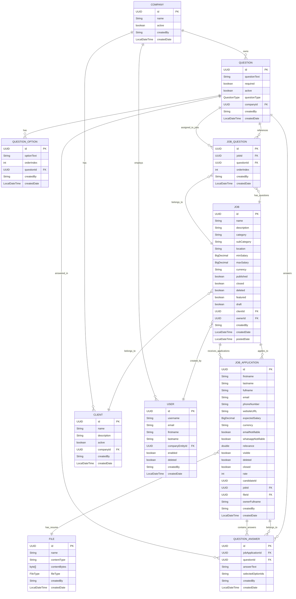

# Question Workflow and UI Design Documentation

## Table of Contents
1. [Question Workflow Deep Dive](#question-workflow-deep-dive)
2. [Backend Architecture](#backend-architecture)
3. [UI/UX Design Recommendations](#uiux-design-recommendations)
4. [React Component Mockups](#react-component-mockups)
5. [API Endpoints Documentation](#api-endpoints-documentation)
6. [Implementation Guidelines](#implementation-guidelines)

---

## Question Workflow Deep Dive

### Overview
The question system allows companies to create custom questionnaires for job applications, enabling them to gather specific information from candidates beyond the standard application form. The workflow supports multiple question types, dynamic assignment to jobs, and structured answer collection.

### Database Entity Relationship Diagram

The following diagram shows the complete database schema for the question system and its relationships with existing entities:



### Question Types and Usage

| Question Type | Description | Requires Options | Example Usage |
|---------------|-------------|------------------|---------------|
| **STRING** | Free-text answers | No | "Describe your experience with Java" |
| **NUMBER** | Numeric answers | No | "Years of experience", "Expected salary" |
| **MULTIPLE_SELECTION** | Multiple choice with multiple selections allowed | Yes | "Which programming languages do you know?" |
| **UNIQUE_SELECTION** | Single choice from multiple options | Yes | "What is your preferred work arrangement?" |

### Key Relationships Explained

1. **Company → Questions**: Each company can create multiple questions for their job applications
2. **Question → Options**: Choice-based questions (MULTIPLE_SELECTION, UNIQUE_SELECTION) can have multiple predefined options
3. **Job → Questions**: Jobs can be assigned a subset of the company's questions via the JobQuestion junction table
4. **JobApplication → Answers**: When candidates apply, their answers are stored in QuestionAnswer entities
5. **Order Management**: Both JobQuestion and QuestionOption have orderIndex fields to control display order

### Complete Workflow Process

#### Phase 1: Question Management (Company Admin)
```java
@Entity
public class QuestionOption {
    private UUID id;
    private String optionText;          // The option text
    private int orderIndex;             // Display order within the question
    private Question question;          // Parent question
}

#### 4. Job-Question Assignment
```java
@Entity
public class JobQuestion {
    private UUID id;
    private Job job;                    // The job posting
    private Question question;          // The assigned question
    private int orderIndex;             // Order within the job
}
```

#### 5. Question Answer Collection
```java
@Entity
public class QuestionAnswer {
    private UUID id;
    private String answerText;          // The candidate's answer
    private Question question;          // The question being answered
    private JobApplication jobApplication; // The application containing this answer
}
```

### Complete Workflow Process

#### Phase 1: Question Management (Company Admin)
1. **Question Creation**
   - Company admin creates questions in the question bank
   - Questions are categorized by type and marked as required/optional
   - For MULTIPLE_SELECTION and UNIQUE_SELECTION types, options are created with order indices
   - Questions are stored without order indices (ordering is handled at job level)

2. **Question Bank Management**
   - View all company questions
   - Edit existing questions
   - Activate/deactivate questions
   - Reorder questions

#### Phase 2: Job Creation with Question Assignment
1. **Job Creation Process**
   - Admin creates a new featured job posting
   - Selects relevant questions from the company question bank
   - Assigns questions to the specific job (3 out of 10 available questions)
   - Questions maintain their order within the job context

2. **Question Selection Interface**
   - Display available questions by category
   - Allow drag-and-drop reordering
   - Preview question appearance to candidates
   - Validate required questions are included

#### Phase 3: Candidate Application Process
1. **Application Form Display**
   - Show standard job application fields
   - Display assigned questions in order
   - Different input types based on question type
   - Real-time validation for required fields

2. **Answer Collection**
   - Collect answers in structured format
   - Validate answers against question requirements
   - Save answers linked to the job application

#### Phase 4: Answer Review and Management
1. **Application Review**
   - Display candidate answers alongside application details
   - Sort and filter applications by question responses
   - Export answers for analysis

2. **Analytics and Reporting**
   - Aggregate answer statistics
   - Identify common response patterns
   - Generate reports for hiring decisions

---

## Backend Architecture

### Service Layer Architecture

#### 1. QuestionService
```java
@Service
public class QuestionService {
    // CRUD operations for questions
    public Question saveQuestion(QuestionSaveRequest request);
    public Question updateQuestion(UUID id, QuestionSaveRequest request);
    public void deleteQuestion(UUID id);
    public List<Question> getQuestionsByCompany(UUID companyId);
    public List<Question> reorderQuestions(List<UUID> questionIds);
    
    // Answer management
    public void saveQuestionAnswers(JobApplication jobApplication, 
                                   List<QuestionAnswerRequest> answers);
    public List<QuestionAnswer> getAnswersByApplication(UUID jobApplicationId);
}
```

#### 2. JobQuestionService
```java
@Service
public class JobQuestionService {
    // Job-question assignment
    public void assignQuestionsToJob(UUID jobId, List<UUID> questionIds);
    public void removeQuestionFromJob(UUID jobId, UUID questionId);
    public List<Question> getActiveQuestionsByJob(UUID jobId);
    public void reorderQuestionsInJob(UUID jobId, List<UUID> questionIds);
}
```

#### 3. JobApplicationService Integration
```java
@Service
public class JobApplicationService {
    @Transactional
    public JobApplication applyToJob(UUID jobId, 
                                   String applyToFeatureJobRequest, 
                                   MultipartFile file) {
        // ... standard application logic ...
        
        // Save questionnaire answers if provided
        if (request.getQuestionAnswers() != null && !request.getQuestionAnswers().isEmpty()) {
            validateAndSaveQuestionAnswers(finalSavedJobApplication, 
                                         request.getQuestionAnswers(), 
                                         savedJob);
            finalSavedJobApplication = jobApplicationRepository.saveAndFlush(finalSavedJobApplication);
        }
        
        return finalSavedJobApplication;
    }
}
```

### API Endpoints

#### Question Management APIs
```http
GET    /api/questions                    # Get all company questions
POST   /api/questions                    # Create new question
PUT    /api/questions/{id}               # Update question
DELETE /api/questions/{id}               # Delete question
GET    /api/questions/types              # Get available question types
POST   /api/questions/reorder            # Reorder questions
```

#### Job-Question Assignment APIs
```http
GET    /api/jobs/{id}/questions          # Get questions assigned to job
POST   /api/jobs/{id}/questions          # Assign questions to job
DELETE /api/jobs/{id}/questions/{questionId}  # Remove question from job
POST   /api/jobs/{id}/questions/reorder  # Reorder questions in job
```

#### Application APIs (Enhanced)
```http
POST   /api/jobs/{id}/apply              # Apply to job with question answers
GET    /api/applications/{id}/answers    # Get answers for application
```

---

## UI/UX Design Recommendations

### Design Principles

#### 1. Progressive Disclosure
- Show questions in logical groups
- Use collapsible sections for long questionnaires
- Provide progress indicators for multi-step processes

#### 2. Contextual Help
- Tooltips explaining question types
- Examples for complex questions
- Validation messages with clear guidance

#### 3. Responsive Design
- Mobile-first approach for candidate applications
- Desktop-optimized for admin management
- Touch-friendly interfaces for mobile devices

#### 4. Accessibility
- WCAG 2.1 AA compliance
- Screen reader support
- Keyboard navigation
- High contrast mode support

### User Experience Flow

#### For Company Admins
1. **Question Bank Management**
   - Intuitive question creation wizard
   - Drag-and-drop reordering
   - Bulk operations for efficiency

2. **Job Creation Integration**
   - Seamless question selection during job posting
   - Preview mode to see candidate experience
   - Quick templates for common question sets

#### For Candidates
1. **Application Experience**
   - Clear progress indication
   - Save draft functionality
   - Mobile-optimized input fields

2. **Question Presentation**
   - Clean, distraction-free interface
   - Logical grouping of related questions
   - Helpful hints and examples

---

## React Component Mockups

### Visual UI Mockups

#### 1. Question Bank Dashboard - Visual Layout
```
┌─────────────────────────────────────────────────────────────────────────────┐
│ 🏢 JobPosting Platform                                    👤 Admin User ▼ │
├─────────────────────────────────────────────────────────────────────────────┤
│ 📊 Dashboard > 📝 Question Bank                                             │
├─────────────────────────────────────────────────────────────────────────────┤
│                                                                             │
│  Question Bank                                    [+ Create New Question]   │
│                                                                             │
│  ┌─────────────────────────────────────────────────────────────────────┐   │
│  │ 🔍 Search questions...  [Filter ▼] [Type ▼] [Status ▼] [Sort ▼]   │   │
│  └─────────────────────────────────────────────────────────────────────┘   │
│                                                                             │
│  ┌─────────────────────────────────────────────────────────────────────┐   │
│  │ 📝 What is your experience with Java and Spring Boot?              │   │
│  │ 📋 STRING • Required • Active • Order: 1                          │   │
│  │ [✏️ Edit] [🗑️ Delete] [👁️ Preview]                               │   │
│  └─────────────────────────────────────────────────────────────────────┘   │
│                                                                             │
│  ┌─────────────────────────────────────────────────────────────────────┐   │
│  │ 🔢 How many years of experience do you have?                       │   │
│  │ 📋 NUMBER • Required • Active • Order: 2                          │   │
│  │ [✏️ Edit] [🗑️ Delete] [👁️ Preview]                               │   │
│  └─────────────────────────────────────────────────────────────────────┘   │
│                                                                             │
│  ┌─────────────────────────────────────────────────────────────────────┐   │
│  │ ☑️ Which technologies are you familiar with? (Select all that apply)│   │
│  │ 📋 MULTIPLE_SELECTION • Optional • Active • Order: 3              │   │
│  │ [✏️ Edit] [🗑️ Delete] [👁️ Preview]                               │   │
│  └─────────────────────────────────────────────────────────────────────┘   │
│                                                                             │
│  ┌─────────────────────────────────────────────────────────────────────┐   │
│  │ 🔘 What is your preferred work arrangement?                        │   │
│  │ 📋 UNIQUE_SELECTION • Required • Active • Order: 4                │   │
│  │ [✏️ Edit] [🗑️ Delete] [👁️ Preview]                               │   │
│  └─────────────────────────────────────────────────────────────────────┘   │
│                                                                             │
│  [← Previous] [1] [2] [3] [Next →]                                        │
└─────────────────────────────────────────────────────────────────────────────┘
```

#### 2. Question Creation Form - Visual Layout
```
┌─────────────────────────────────────────────────────────────────────────────┐
│ ✏️ Create New Question                                                      │
├─────────────────────────────────────────────────────────────────────────────┤
│                                                                             │
│  Question Text *                                                            │
│  ┌─────────────────────────────────────────────────────────────────────┐   │
│  │ What is your experience with Java and Spring Boot?                 │   │
│  │                                                                     │   │
│  └─────────────────────────────────────────────────────────────────────┘   │
│                                                                             │
│  Question Type *                                                            │
│  ┌─────────────┐ ┌─────────────┐ ┌─────────────┐ ┌─────────────┐         │
│  │ 📝 Text     │ │ 🔢 Number   │ │ ☑️ Multiple │ │ 🔘 Single   │         │
│  │ Answer      │ │             │ │ Choice      │ │ Choice      │         │
│  │ ✓ Selected  │ │             │ │             │ │             │         │
│  └─────────────┘ └─────────────┘ └─────────────┘ └─────────────┘         │
│                                                                             │
│  Answer Options (for Multiple/Single Choice)                               │
│  ┌─────────────────────────────────────────────────────────────────────┐   │
│  │ Option 1: [Enter option text...]                            [🗑️]   │   │
│  │ Option 2: [Enter option text...]                            [🗑️]   │   │
│  │ Option 3: [Enter option text...]                            [🗑️]   │   │
│  │                                                                     │   │
│  │ [+ Add Option]                                                     │   │
│  └─────────────────────────────────────────────────────────────────────┘   │
│                                                                             │
│  ☑️ Required Question                                                       │
│  ☑️ Active                                                                  │
│                                                                             │
│  ┌─────────────────────────────────────────────────────────────────────┐   │
│  │                              [Cancel] [Create Question]             │   │
│  └─────────────────────────────────────────────────────────────────────┘   │
└─────────────────────────────────────────────────────────────────────────────┘
```

#### 3. Job Creation with Question Assignment - Visual Layout
```
┌─────────────────────────────────────────────────────────────────────────────┐
│ 🏢 JobPosting Platform > 📝 Create Featured Job                            │
├─────────────────────────────────────────────────────────────────────────────┤
│                                                                             │
│  Job Details                                                                 │
│  ┌─────────────────────────────────────────────────────────────────────┐   │
│  │ Job Title: [Senior Java Developer                    ]              │   │
│  │ Description: [We are looking for an experienced...]                 │   │
│  │ Category: [Technology ▼] Location: [Remote ▼]                      │   │
│  │ Min Salary: [$70,000] Max Salary: [$100,000]                       │   │
│  └─────────────────────────────────────────────────────────────────────┘   │
│                                                                             │
│  Application Questions                                                      │
│  Select questions from your question bank to include in this job application│
│                                                                             │
│  ┌───────────────────────────────┐ ┌─────────────────────────────────────┐ │
│  │ Available Questions           │ │ Selected Questions (3)              │ │
│  │                               │ │                                     │ │
│  │ 🔍 Search... [Filter ▼]      │ │ ┌─────────────────────────────────┐ │ │
│  │                               │ │ │ 1. What is your experience...  │ │ │
│  │ ┌─────────────────────────┐   │ │ │ [📝 STRING] [↕️] [🗑️]        │ │ │
│  │ │ 📝 Java Experience      │   │ │ └─────────────────────────────────┘ │ │
│  │ │ [Add →]                │   │ │                                     │ │
│  │ └─────────────────────────┘   │ │ ┌─────────────────────────────────┐ │ │
│  │                               │ │ │ 2. Years of experience?         │ │ │
│  │ ┌─────────────────────────┐   │ │ │ [🔢 NUMBER] [↕️] [🗑️]         │ │ │
│  │ │ 🔢 Years Experience     │   │ │ └─────────────────────────────────┘ │ │
│  │ │ [Add →]                │   │ │                                     │ │
│  │ └─────────────────────────┘   │ │ ┌─────────────────────────────────┐ │ │
│  │                               │ │ │ 3. Which technologies?          │ │ │
│  │ ┌─────────────────────────┐   │ │ │ [☑️ MULTIPLE] [↕️] [🗑️]       │ │ │
│  │ │ ☑️ Technologies         │   │ │ └─────────────────────────────────┘ │ │
│  │ │ [Add →]                │   │ │                                     │ │
│  │ └─────────────────────────┘   │ │                                     │ │
│  └───────────────────────────────┘ └─────────────────────────────────────┘ │
│                                                                             │
│  Preview                                                                     │
│  ┌─────────────────────────────────────────────────────────────────────┐   │
│  │ 📝 What is your experience with Java and Spring Boot?              │   │
│  │ ┌─────────────────────────────────────────────────────────────────┐ │   │
│  │ │ [Text area for candidate answer...]                            │ │   │
│  │ └─────────────────────────────────────────────────────────────────┘ │   │
│  │                                                                     │   │
│  │ 🔢 How many years of experience do you have?                       │   │
│  │ ┌─────────────────────────────────────────────────────────────────┐ │   │
│  │ │ [Number input field...]                                        │ │   │
│  │ └─────────────────────────────────────────────────────────────────┘ │   │
│  └─────────────────────────────────────────────────────────────────────┘   │
│                                                                             │
│  [Save Draft] [Publish Job]                                                 │
└─────────────────────────────────────────────────────────────────────────────┘
```

#### 4. Candidate Application Form - Visual Layout
```
┌─────────────────────────────────────────────────────────────────────────────┐
│ 🏢 JobPosting Platform > 💼 Apply to Job                                   │
├─────────────────────────────────────────────────────────────────────────────┤
│                                                                             │
│  Senior Java Developer                                                      │
│  TechCorp Inc. • Remote • $70,000 - $100,000                               │
│                                                                             │
│  ████████████████████████████████████████████████████████████████ 75%      │
│  Step 1 ✓  Step 2 ✓  Step 3 ●  Step 4 ○                                   │
│                                                                             │
│  Application Questions                                                      │
│                                                                             │
│  ┌─────────────────────────────────────────────────────────────────────┐   │
│  │ 📝 What is your experience with Java and Spring Boot? *             │   │
│  │ ┌─────────────────────────────────────────────────────────────────┐ │   │
│  │ │ I have 5 years of experience working with Java and Spring...   │ │   │
│  │ │                                                               │ │   │
│  │ │                                                               │ │   │
│  │ └─────────────────────────────────────────────────────────────────┘ │   │
│  └─────────────────────────────────────────────────────────────────────┘   │
│                                                                             │
│  ┌─────────────────────────────────────────────────────────────────────┐   │
│  │ 🔢 How many years of experience do you have? *                      │   │
│  │ ┌─────────────────────────────────────────────────────────────────┐ │   │
│  │ │ [5                    ] years                                  │ │   │
│  │ └─────────────────────────────────────────────────────────────────┘ │   │
│  └─────────────────────────────────────────────────────────────────────┘   │
│                                                                             │
│  ┌─────────────────────────────────────────────────────────────────────┐   │
│  │ ☑️ Which technologies are you familiar with?                        │   │
│  │ ┌─────────────────────────────────────────────────────────────────┐ │   │
│  │ │ ☑️ Java                                                         │ │   │
│  │ │ ☑️ Spring Boot                                                  │ │   │
│  │ │ ☐ React                                                         │ │   │
│  │ │ ☐ Node.js                                                       │ │   │
│  │ │ ☑️ PostgreSQL                                                   │ │   │
│  │ └─────────────────────────────────────────────────────────────────┘ │   │
│  └─────────────────────────────────────────────────────────────────────┘   │
│                                                                             │
│  ┌─────────────────────────────────────────────────────────────────────┐   │
│  │ 🔘 What is your preferred work arrangement? *                       │   │
│  │ ┌─────────────────────────────────────────────────────────────────┐ │   │
│  │ │ 🔘 Remote                                                       │ │   │
│  │ │ ⚪ Hybrid                                                        │ │   │
│  │ │ ⚪ On-site                                                       │ │   │
│  │ └─────────────────────────────────────────────────────────────────┘ │   │
│  └─────────────────────────────────────────────────────────────────────┘   │
│                                                                             │
│  [← Back] [Save Draft] [Next →]                                            │
└─────────────────────────────────────────────────────────────────────────────┘
```

#### 5. Application Review Dashboard - Visual Layout
```
┌─────────────────────────────────────────────────────────────────────────────┐
│ 🏢 JobPosting Platform > 📊 Applications                                   │
├─────────────────────────────────────────────────────────────────────────────┤
│                                                                             │
│  Applications for Senior Java Developer                                     │
│  📊 47 Total Applications • 🔵 12 New • 🟡 8 In Review • 🟢 5 Approved    │
│                                                                             │
│  ┌─────────────────────────────────────────────────────────────────────┐   │
│  │ 🔍 Filter: [All Status ▼] [All Questions ▼] [Date Range ▼]         │   │
│  └─────────────────────────────────────────────────────────────────────┘   │
│                                                                             │
│  ┌───────────────────────────────┐ ┌─────────────────────────────────────┐ │
│  │ Applications List             │ │ Application Details                 │ │
│  │                               │ │                                     │ │
│  │ ┌─────────────────────────┐   │ │ John Doe                            │ │
│  │ │ 👤 John Doe            │   │ │ john.doe@email.com                  │ │
│  │ │ 📧 john.doe@email.com  │   │ │ +1 (555) 123-4567                   │ │
│  │ │ 📅 Applied 2 days ago  │   │ │                                     │ │
│  │ │ 🟢 Status: New         │   │ │ Application Questions:              │ │
│  │ │ [View Details →]       │   │ │                                     │ │
│  │ └─────────────────────────┘   │ │ 📝 Java Experience:                 │ │
│  │                               │ │ "I have 5 years of experience..."  │ │
│  │ ┌─────────────────────────┐   │ │                                     │ │
│  │ │ 👤 Jane Smith          │   │ │ 🔢 Years of Experience:             │ │
│  │ │ 📧 jane@email.com      │   │ │ 5 years                             │ │
│  │ │ 📅 Applied 1 day ago   │   │ │                                     │ │
│  │ │ 🟡 Status: In Review   │   │ │ ☑️ Technologies:                    │ │
│  │ │ [View Details →]       │   │ │ Java, Spring Boot, PostgreSQL      │ │
│  │ └─────────────────────────┘   │ │                                     │ │
│  │                               │ │ 🔘 Work Arrangement:               │ │
│  │ ┌─────────────────────────┐   │ │ Remote                             │ │
│  │ │ 👤 Bob Johnson         │   │ │                                     │ │
│  │ │ 📧 bob@email.com       │   │ │ [Approve] [Reject] [Request Info]   │ │
│  │ │ 📅 Applied 3 hours ago │   │ │                                     │ │
│  │ │ 🟢 Status: New         │   │ │                                     │ │
│  │ │ [View Details →]       │   │ │                                     │ │
│  │ └─────────────────────────┘   │ │                                     │ │
│  └───────────────────────────────┘ └─────────────────────────────────────┘ │
│                                                                             │
│  [← Previous] [1] [2] [3] [4] [Next →]                                     │
└─────────────────────────────────────────────────────────────────────────────┘
```

#### 6. Mobile Application Form - Visual Layout
```
┌─────────────────────────────────────┐
│ 🏢 JobPosting              👤 Menu │
├─────────────────────────────────────┤
│                                     │
│ Senior Java Developer               │
│ TechCorp Inc.                       │
│ Remote • $70k-$100k                 │
│                                     │
│ ████████████████ 75%                │
│ Step 3 of 4                         │
│                                     │
│ ┌─────────────────────────────────┐ │
│ │ 📝 Java Experience *           │ │
│ │ ┌─────────────────────────────┐ │ │
│ │ │ I have 5 years of exp...   │ │ │
│ │ │                             │ │ │
│ │ └─────────────────────────────┘ │ │
│ └─────────────────────────────────┘ │
│                                     │
│ ┌─────────────────────────────────┐ │
│ │ 🔢 Years Experience *          │ │
│ │ ┌─────────────────────────────┐ │ │
│ │ │ [5        ] years           │ │ │
│ │ └─────────────────────────────┘ │ │
│ └─────────────────────────────────┘ │
│                                     │
│ ┌─────────────────────────────────┐ │
│ │ ☑️ Technologies                │ │
│ │ ┌─────────────────────────────┐ │ │
│ │ │ ☑️ Java                     │ │ │
│ │ │ ☑️ Spring Boot              │ │ │
│ │ │ ☐ React                     │ │ │
│ │ │ ☑️ PostgreSQL               │ │ │
│ │ └─────────────────────────────┘ │ │
│ └─────────────────────────────────┘ │
│                                     │
│ ┌─────────────────────────────────┐ │
│ │ 🔘 Work Arrangement *          │ │
│ │ ┌─────────────────────────────┐ │ │
│ │ │ 🔘 Remote                   │ │
│ │ │ ⚪ Hybrid                    │ │
│ │ │ ⚪ On-site                   │ │
│ │ └─────────────────────────────┘ │ │
│ └─────────────────────────────────┘ │
│                                     │
│ [← Back]    [Save]    [Next →]     │
└─────────────────────────────────────┘
```

#### 7. Mobile Question Bank - Visual Layout
```
┌─────────────────────────────────────┐
│ 📝 Question Bank            🔍 + ➕ │
├─────────────────────────────────────┤
│                                     │
│ [All ▼] [Active ▼] [Type ▼]        │
│                                     │
│ ┌─────────────────────────────────┐ │
│ │ 📝 Java Experience             │ │
│ │ STRING • Required • Active     │ │
│ │ [✏️] [🗑️] [👁️]                │ │
│ └─────────────────────────────────┘ │
│                                     │
│ ┌─────────────────────────────────┐ │
│ │ 🔢 Years Experience            │ │
│ │ NUMBER • Required • Active     │ │
│ │ [✏️] [🗑️] [👁️]                │ │
│ └─────────────────────────────────┘ │
│                                     │
│ ┌─────────────────────────────────┐ │
│ │ ☑️ Technologies                │ │
│ │ MULTIPLE • Optional • Active   │ │
│ │ [✏️] [🗑️] [👁️]                │ │
│ └─────────────────────────────────┘ │
│                                     │
│ ┌─────────────────────────────────┐ │
│ │ 🔘 Work Arrangement            │ │
│ │ UNIQUE • Required • Active     │ │
│ │ [✏️] [🗑️] [👁️]                │ │
│ └─────────────────────────────────┘ │
│                                     │
│ [←] [1] [2] [3] [→]                │
└─────────────────────────────────────┘
```

### Color Scheme and Visual Design Guidelines

#### Primary Colors
```
🎨 Brand Colors:
- Primary Blue: #2563eb (Buttons, Links, Active States)
- Secondary Gray: #6b7280 (Text, Borders, Secondary Elements)
- Success Green: #10b981 (Success States, Approved Status)
- Warning Yellow: #f59e0b (Pending, In Review)
- Error Red: #ef4444 (Errors, Rejected Status)
- Background: #f9fafb (Light Gray Background)
```

#### Typography
```
📝 Font Hierarchy:
- Headers: Inter Bold, 24px-32px
- Subheaders: Inter Semibold, 18px-20px
- Body Text: Inter Regular, 14px-16px
- Small Text: Inter Regular, 12px-14px
- Monospace: JetBrains Mono, 14px (Code, Numbers)
```

#### Component Styling
```
🔧 UI Components:
- Border Radius: 8px (Cards, Buttons)
- Shadows: 0 1px 3px rgba(0,0,0,0.1) (Cards)
- Spacing: 16px grid system
- Icons: Heroicons or Lucide React
- Loading States: Skeleton loaders
```

### Interactive Elements

#### Hover States
```
🖱️ Interactive Feedback:
- Buttons: Scale 1.02, Shadow increase
- Cards: Subtle shadow increase, border color change
- Links: Color transition, underline animation
- Form Fields: Border color change, focus ring
```

#### Loading States
```
⏳ Loading Indicators:
- Skeleton loaders for question lists
- Progress bars for form steps
- Spinner for API calls
- Shimmer effect for data loading
```

#### Error States
```
❌ Error Handling:
- Inline validation messages
- Form field error styling (red border)
- Toast notifications for API errors
- Error boundaries for component crashes
```

### Accessibility Features

#### Screen Reader Support
```
♿ Accessibility:
- ARIA labels for all interactive elements
- Semantic HTML structure (nav, main, section)
- Alt text for all images and icons
- Focus management for modals and forms
```

#### Keyboard Navigation
```
⌨️ Keyboard Support:
- Tab order follows logical flow
- Escape key closes modals
- Enter/Space activates buttons
- Arrow keys navigate question options
```

#### Visual Accessibility
```
👁️ Visual Support:
- High contrast mode support
- Focus indicators (2px blue outline)
- Color-blind friendly palette
- Minimum 44px touch targets
```

### 1. Question Management Dashboard

```jsx
// QuestionBankDashboard.jsx
import React, { useState } from 'react';
import { QuestionCard, QuestionForm, QuestionTypeSelector } from './components';

const QuestionBankDashboard = () => {
  const [questions, setQuestions] = useState([]);
  const [showCreateForm, setShowCreateForm] = useState(false);

  return (
    <div className="question-bank-dashboard">
      <div className="dashboard-header">
        <h1>Question Bank</h1>
        <button 
          className="btn btn-primary"
          onClick={() => setShowCreateForm(true)}
        >
          Create New Question
        </button>
      </div>

      <div className="question-filters">
        <QuestionTypeFilter />
        <StatusFilter />
        <SearchBar placeholder="Search questions..." />
      </div>

      <div className="questions-grid">
        {questions.map(question => (
          <QuestionCard 
            key={question.id}
            question={question}
            onEdit={handleEdit}
            onDelete={handleDelete}
            onReorder={handleReorder}
          />
        ))}
      </div>

      {showCreateForm && (
        <QuestionForm 
          onSave={handleCreateQuestion}
          onCancel={() => setShowCreateForm(false)}
        />
      )}
    </div>
  );
};
```

### 2. Question Creation Form

```jsx
// QuestionForm.jsx
import React, { useState } from 'react';

const QuestionForm = ({ question, onSave, onCancel }) => {
  const [formData, setFormData] = useState({
    questionText: question?.questionText || '',
    questionType: question?.questionType || 'STRING',
    required: question?.required || false,
    active: question?.active || true,
    options: question?.options || []
  });

  const questionTypes = [
    { value: 'STRING', label: 'Text Answer', icon: '📝' },
    { value: 'NUMBER', label: 'Number', icon: '🔢' },
    { value: 'MULTIPLE_SELECTION', label: 'Multiple Choice', icon: '☑️' },
    { value: 'UNIQUE_SELECTION', label: 'Single Choice', icon: '🔘' }
  ];

  return (
    <div className="question-form-modal">
      <div className="modal-header">
        <h2>{question ? 'Edit Question' : 'Create New Question'}</h2>
      </div>

      <form onSubmit={handleSubmit} className="question-form">
        <div className="form-group">
          <label htmlFor="questionText">Question Text *</label>
          <textarea
            id="questionText"
            value={formData.questionText}
            onChange={(e) => setFormData({...formData, questionText: e.target.value})}
            placeholder="Enter your question here..."
            rows={3}
            required
          />
        </div>

        <div className="form-group">
          <label>Question Type *</label>
          <div className="question-type-selector">
            {questionTypes.map(type => (
              <div 
                key={type.value}
                className={`type-option ${formData.questionType === type.value ? 'selected' : ''}`}
                onClick={() => setFormData({...formData, questionType: type.value})}
              >
                <span className="type-icon">{type.icon}</span>
                <span className="type-label">{type.label}</span>
              </div>
            ))}
          </div>
        </div>

        {(formData.questionType === 'MULTIPLE_SELECTION' || 
          formData.questionType === 'UNIQUE_SELECTION') && (
          <div className="form-group">
            <label>Answer Options</label>
            <OptionsEditor 
              options={formData.options}
              onChange={(options) => setFormData({...formData, options})}
            />
          </div>
        )}

        <div className="form-group checkbox-group">
          <label className="checkbox-label">
            <input
              type="checkbox"
              checked={formData.required}
              onChange={(e) => setFormData({...formData, required: e.target.checked})}
            />
            <span className="checkmark"></span>
            Required Question
          </label>
        </div>

        <div className="form-group checkbox-group">
          <label className="checkbox-label">
            <input
              type="checkbox"
              checked={formData.active}
              onChange={(e) => setFormData({...formData, active: e.target.checked})}
            />
            <span className="checkmark"></span>
            Active
          </label>
        </div>

        <div className="form-actions">
          <button type="button" onClick={onCancel} className="btn btn-secondary">
            Cancel
          </button>
          <button type="submit" className="btn btn-primary">
            {question ? 'Update Question' : 'Create Question'}
          </button>
        </div>
      </form>
    </div>
  );
};
```

### 3. Job Creation with Question Assignment

```jsx
// JobCreationWithQuestions.jsx
import React, { useState, useEffect } from 'react';
import { QuestionSelector, QuestionPreview } from './components';

const JobCreationWithQuestions = ({ onJobCreate }) => {
  const [jobData, setJobData] = useState({
    name: '',
    description: '',
    category: '',
    // ... other job fields
    questionIds: []
  });
  const [availableQuestions, setAvailableQuestions] = useState([]);
  const [selectedQuestions, setSelectedQuestions] = useState([]);

  return (
    <div className="job-creation-form">
      <div className="form-section">
        <h2>Job Details</h2>
        {/* Standard job form fields */}
        <JobBasicInfo 
          data={jobData}
          onChange={setJobData}
        />
      </div>

      <div className="form-section">
        <h2>Application Questions</h2>
        <p className="section-description">
          Select questions from your question bank to include in this job application.
        </p>

        <div className="question-assignment-container">
          <div className="available-questions">
            <h3>Available Questions</h3>
            <div className="question-filters">
              <QuestionTypeFilter />
              <SearchBar />
            </div>
            <QuestionList
              questions={availableQuestions}
              selectedIds={jobData.questionIds}
              onSelect={handleQuestionSelect}
              onDeselect={handleQuestionDeselect}
            />
          </div>

          <div className="selected-questions">
            <h3>Selected Questions ({selectedQuestions.length})</h3>
            <DraggableQuestionList
              questions={selectedQuestions}
              onReorder={handleQuestionReorder}
              onRemove={handleQuestionRemove}
            />
          </div>
        </div>

        <div className="question-preview">
          <h3>Preview</h3>
          <QuestionPreview questions={selectedQuestions} />
        </div>
      </div>

      <div className="form-actions">
        <button onClick={handleSaveDraft} className="btn btn-secondary">
          Save Draft
        </button>
        <button onClick={handlePublishJob} className="btn btn-primary">
          Publish Job
        </button>
      </div>
    </div>
  );
};
```

### 4. Candidate Application Form

```jsx
// JobApplicationForm.jsx
import React, { useState, useEffect } from 'react';
import { ProgressBar, QuestionInput } from './components';

const JobApplicationForm = ({ job, onSubmit }) => {
  const [currentStep, setCurrentStep] = useState(0);
  const [formData, setFormData] = useState({
    personalInfo: {},
    questionAnswers: {}
  });

  const steps = [
    { id: 'personal', title: 'Personal Information' },
    { id: 'resume', title: 'Resume Upload' },
    { id: 'questions', title: 'Application Questions' },
    { id: 'review', title: 'Review & Submit' }
  ];

  const totalSteps = steps.length;
  const progress = ((currentStep + 1) / totalSteps) * 100;

  return (
    <div className="job-application-form">
      <div className="application-header">
        <h1>{job.name}</h1>
        <div className="company-info">
          <span>{job.company}</span>
          <span>•</span>
          <span>{job.location}</span>
        </div>
      </div>

      <ProgressBar progress={progress} steps={steps} currentStep={currentStep} />

      <div className="form-content">
        {currentStep === 0 && (
          <PersonalInfoStep 
            data={formData.personalInfo}
            onChange={(data) => setFormData({...formData, personalInfo: data})}
            onNext={() => setCurrentStep(1)}
          />
        )}

        {currentStep === 1 && (
          <ResumeUploadStep 
            onUpload={handleResumeUpload}
            onNext={() => setCurrentStep(2)}
            onBack={() => setCurrentStep(0)}
          />
        )}

        {currentStep === 2 && (
          <QuestionsStep 
            questions={job.assignedQuestions}
            answers={formData.questionAnswers}
            onChange={(answers) => setFormData({...formData, questionAnswers: answers})}
            onNext={() => setCurrentStep(3)}
            onBack={() => setCurrentStep(1)}
          />
        )}

        {currentStep === 3 && (
          <ReviewStep 
            job={job}
            formData={formData}
            onSubmit={handleSubmit}
            onBack={() => setCurrentStep(2)}
          />
        )}
      </div>
    </div>
  );
};
```

### 5. Question Input Components

```jsx
// QuestionInput.jsx
import React from 'react';

const QuestionInput = ({ question, value, onChange, error }) => {
  const renderInput = () => {
    switch (question.questionType) {
      case 'STRING':
        return (
          <textarea
            value={value}
            onChange={(e) => onChange(e.target.value)}
            placeholder="Enter your answer..."
            rows={4}
            className={`form-control ${error ? 'error' : ''}`}
          />
        );

      case 'NUMBER':
        return (
          <input
            type="number"
            value={value}
            onChange={(e) => onChange(e.target.value)}
            placeholder="Enter a number..."
            className={`form-control ${error ? 'error' : ''}`}
          />
        );

      case 'MULTIPLE_SELECTION':
        return (
          <div className="checkbox-group">
            {question.options.map(option => (
              <label key={option.id} className="checkbox-option">
                <input
                  type="checkbox"
                  checked={value?.includes(option.id) || false}
                  onChange={(e) => handleMultipleSelection(option.id, e.target.checked)}
                />
                <span className="checkmark"></span>
                {option.text}
              </label>
            ))}
          </div>
        );

      case 'UNIQUE_SELECTION':
        return (
          <div className="radio-group">
            {question.options.map(option => (
              <label key={option.id} className="radio-option">
                <input
                  type="radio"
                  name={`question_${question.id}`}
                  value={option.id}
                  checked={value === option.id}
                  onChange={(e) => onChange(e.target.value)}
                />
                <span className="radio-mark"></span>
                {option.text}
              </label>
            ))}
          </div>
        );

      default:
        return <div>Unsupported question type</div>;
    }
  };

  return (
    <div className="question-input">
      <div className="question-header">
        <h3 className="question-text">{question.questionText}</h3>
        {question.required && <span className="required-indicator">*</span>}
      </div>
      
      {renderInput()}
      
      {error && <div className="error-message">{error}</div>}
    </div>
  );
};
```

### 6. Application Review Dashboard

```jsx
// ApplicationReviewDashboard.jsx
import React, { useState } from 'react';
import { ApplicationCard, AnswerViewer, FilterPanel } from './components';

const ApplicationReviewDashboard = ({ job }) => {
  const [applications, setApplications] = useState([]);
  const [selectedApplication, setSelectedApplication] = useState(null);
  const [filters, setFilters] = useState({});

  return (
    <div className="application-review-dashboard">
      <div className="dashboard-header">
        <h1>Applications for {job.name}</h1>
        <div className="application-stats">
          <span className="stat">
            <strong>{applications.length}</strong> Total Applications
          </span>
          <span className="stat">
            <strong>{applications.filter(app => app.status === 'NEW').length}</strong> New
          </span>
        </div>
      </div>

      <div className="dashboard-content">
        <div className="applications-list">
          <FilterPanel 
            filters={filters}
            onChange={setFilters}
            questions={job.assignedQuestions}
          />
          
          <div className="applications-grid">
            {applications.map(application => (
              <ApplicationCard
                key={application.id}
                application={application}
                onClick={() => setSelectedApplication(application)}
                isSelected={selectedApplication?.id === application.id}
              />
            ))}
          </div>
        </div>

        {selectedApplication && (
          <div className="application-details">
            <ApplicationDetailsView 
              application={selectedApplication}
              questions={job.assignedQuestions}
              onStatusChange={handleStatusChange}
            />
          </div>
        )}
      </div>
    </div>
  );
};
```

---

## API Endpoints Documentation

This section provides detailed information about all API endpoints related to the question system, including request/response examples and authentication requirements.

### Authentication
All endpoints require authentication via Bearer token in the Authorization header:
```
Authorization: Bearer <your-jwt-token>
```

### Base URL
```
https://api.jobposting.com/api/v1
```

---

### Question Management Endpoints

#### 1. Get All Questions for Company
**Endpoint:** `GET /questions`
**Description:** Retrieves all questions belonging to the authenticated user's company

**Query Parameters:**
- `page` (optional): Page number (default: 0)
- `size` (optional): Page size (default: 20)
- `sort` (optional): Sort field (default: createdDate,asc)
- `active` (optional): Filter by active status (true/false)

**Response:**
```json
{
  "content": [
    {
      "id": "123e4567-e89b-12d3-a456-426614174000",
      "questionText": "How many years of experience do you have with Java?",
      "required": true,
      "active": true,
      "questionType": "NUMBER",
      "companyId": "456e7890-e89b-12d3-a456-426614174001",
      "options": [],
      "createdDate": "2025-01-15T10:30:00Z",
      "createdBy": "admin@company.com"
    },
    {
      "id": "789e0123-e89b-12d3-a456-426614174002",
      "questionText": "Which programming languages are you proficient in?",
      "required": true,
      "active": true,
      "questionType": "MULTIPLE_SELECTION",
      "companyId": "456e7890-e89b-12d3-a456-426614174001",
      "options": [
        {
          "id": "111e2222-e89b-12d3-a456-426614174003",
          "optionText": "Java",
          "orderIndex": 1
        },
        {
          "id": "222e3333-e89b-12d3-a456-426614174004",
          "optionText": "Python",
          "orderIndex": 2
        },
        {
          "id": "333e4444-e89b-12d3-a456-426614174005",
          "optionText": "JavaScript",
          "orderIndex": 3
        }
      ],
      "createdDate": "2025-01-15T11:00:00Z",
      "createdBy": "admin@company.com"
    }
  ],
  "pageable": {
    "pageNumber": 0,
    "pageSize": 20,
    "sort": {
      "sorted": true,
      "unsorted": false
    }
  },
  "totalElements": 25,
  "totalPages": 2,
  "first": true,
  "last": false
}
```

#### 2. Create New Question
**Endpoint:** `POST /questions`
**Description:** Creates a new question for the company

**Request Body:**
```json
{
  "questionText": "Describe your experience with microservices architecture",
  "required": true,
  "active": true,
  "questionType": "STRING",
  "options": []
}
```

**Response (201 Created):**
```json
{
  "id": "444e5555-e89b-12d3-a456-426614174006",
  "questionText": "Describe your experience with microservices architecture",
  "required": true,
  "active": true,
  "questionType": "STRING",
  "companyId": "456e7890-e89b-12d3-a456-426614174001",
  "options": [],
  "createdDate": "2025-01-15T12:00:00Z",
  "createdBy": "admin@company.com"
}
```

#### 3. Create Question with Options
**Endpoint:** `POST /questions`
**Description:** Creates a question with predefined options

**Request Body:**
```json
{
  "questionText": "What is your preferred work arrangement?",
  "required": true,
  "active": true,
  "questionType": "UNIQUE_SELECTION",
  "options": [
    {
      "optionText": "Remote",
      "orderIndex": 1
    },
    {
      "optionText": "Hybrid",
      "orderIndex": 2
    },
    {
      "optionText": "On-site",
      "orderIndex": 3
    }
  ]
}
```

**Response (201 Created):**
```json
{
  "id": "555e6666-e89b-12d3-a456-426614174007",
  "questionText": "What is your preferred work arrangement?",
  "required": true,
  "active": true,
  "questionType": "UNIQUE_SELECTION",
  "companyId": "456e7890-e89b-12d3-a456-426614174001",
  "options": [
    {
      "id": "666e7777-e89b-12d3-a456-426614174008",
      "optionText": "Remote",
      "orderIndex": 1
    },
    {
      "id": "777e8888-e89b-12d3-a456-426614174009",
      "optionText": "Hybrid",
      "orderIndex": 2
    },
    {
      "id": "888e9999-e89b-12d3-a456-426614174010",
      "optionText": "On-site",
      "orderIndex": 3
    }
  ],
  "createdDate": "2025-01-15T12:30:00Z",
  "createdBy": "admin@company.com"
}
```

#### 4. Get Question by ID
**Endpoint:** `GET /questions/{questionId}`
**Description:** Retrieves a specific question by its ID

**Path Parameters:**
- `questionId`: UUID of the question

**Response:**
```json
{
  "id": "123e4567-e89b-12d3-a456-426614174000",
  "questionText": "How many years of experience do you have with Java?",
  "required": true,
  "active": true,
  "questionType": "NUMBER",
  "companyId": "456e7890-e89b-12d3-a456-426614174001",
  "options": [],
  "createdDate": "2025-01-15T10:30:00Z",
  "createdBy": "admin@company.com"
}
```

#### 5. Update Question
**Endpoint:** `PUT /questions/{questionId}`
**Description:** Updates an existing question

**Path Parameters:**
- `questionId`: UUID of the question

**Request Body:**
```json
{
  "questionText": "How many years of experience do you have with Java and related frameworks?",
  "required": true,
  "active": true,
  "questionType": "NUMBER",
  "options": []
}
```

**Response:**
```json
{
  "id": "123e4567-e89b-12d3-a456-426614174000",
  "questionText": "How many years of experience do you have with Java and related frameworks?",
  "required": true,
  "active": true,
  "questionType": "NUMBER",
  "companyId": "456e7890-e89b-12d3-a456-426614174001",
  "options": [],
  "createdDate": "2025-01-15T10:30:00Z",
  "createdBy": "admin@company.com"
}
```

#### 6. Delete Question
**Endpoint:** `DELETE /questions/{questionId}`
**Description:** Soft deletes a question (sets active to false)

**Path Parameters:**
- `questionId`: UUID of the question

**Response:** `204 No Content`

#### 7. Get Question Types
**Endpoint:** `GET /questions/types`
**Description:** Returns all available question types

**Response:**
```json
[
  "STRING",
  "NUMBER", 
  "MULTIPLE_SELECTION",
  "UNIQUE_SELECTION"
]
```

---

### Job-Question Assignment Endpoints

#### 8. Create Featured Job with Questions
**Endpoint:** `POST /jobs/featured`
**Description:** Creates a new featured job and assigns specific questions to it

**Request Body:**
```json
{
  "name": "Senior Java Developer",
  "description": "We are looking for an experienced Java developer...",
  "category": "Technology",
  "subCategory": "Software Development",
  "location": "Remote",
  "minSalary": 80000,
  "maxSalary": 120000,
  "currency": "USD",
  "featured": true,
  "questionIds": [
    "123e4567-e89b-12d3-a456-426614174000",
    "789e0123-e89b-12d3-a456-426614174002",
    "555e6666-e89b-12d3-a456-426614174007"
  ]
}
```

**Response (201 Created):**
```json
{
  "id": "999e0000-e89b-12d3-a456-426614174011",
  "name": "Senior Java Developer",
  "description": "We are looking for an experienced Java developer...",
  "category": "Technology",
  "subCategory": "Software Development",
  "location": "Remote",
  "minSalary": 80000,
  "maxSalary": 120000,
  "currency": "USD",
  "featured": true,
  "assignedQuestions": [
    {
      "id": "123e4567-e89b-12d3-a456-426614174000",
      "questionText": "How many years of experience do you have with Java?",
      "required": true,
      "active": true,
      "questionType": "NUMBER",
      "orderIndex": 1,
      "options": []
    },
    {
      "id": "789e0123-e89b-12d3-a456-426614174002",
      "questionText": "Which programming languages are you proficient in?",
      "required": true,
      "active": true,
      "questionType": "MULTIPLE_SELECTION",
      "orderIndex": 2,
      "options": [
        {
          "id": "111e2222-e89b-12d3-a456-426614174003",
          "optionText": "Java",
          "orderIndex": 1
        },
        {
          "id": "222e3333-e89b-12d3-a456-426614174004",
          "optionText": "Python",
          "orderIndex": 2
        }
      ]
    }
  ],
  "createdDate": "2025-01-15T13:00:00Z",
  "createdBy": "admin@company.com"
}
```

#### 9. Update Job Questions
**Endpoint:** `PUT /jobs/{jobId}/questions`
**Description:** Updates the questions assigned to a job

**Path Parameters:**
- `jobId`: UUID of the job

**Request Body:**
```json
{
  "questionIds": [
    "123e4567-e89b-12d3-a456-426614174000",
    "555e6666-e89b-12d3-a456-426614174007"
  ]
}
```

**Response:**
```json
{
  "message": "Job questions updated successfully",
  "assignedQuestionsCount": 2
}
```

---

### Job Application Endpoints

#### 10. Apply to Featured Job with Questions
**Endpoint:** `POST /jobs/{jobId}/apply`
**Description:** Submits a job application with questionnaire answers

**Path Parameters:**
- `jobId`: UUID of the job

**Request Body (multipart/form-data):**
```
firstname: "John"
lastname: "Doe"
email: "john.doe@example.com"
phoneNumber: "+1234567890"
websiteURL: "https://johndoe.dev"
whatsappNotification: true
emailNotification: true
expectedSalary: 95000
currency: "USD"
questionAnswers: [
  {
    "questionId": "123e4567-e89b-12d3-a456-426614174000",
    "answerText": "5",
    "selectedOptionIds": []
  },
  {
    "questionId": "789e0123-e89b-12d3-a456-426614174002", 
    "answerText": "",
    "selectedOptionIds": [
      "111e2222-e89b-12d3-a456-426614174003",
      "222e3333-e89b-12d3-a456-426614174004"
    ]
  }
]
file: [resume.pdf file]
```

**Response (201 Created):**
```json
{
  "id": "000e1111-e89b-12d3-a456-426614174012",
  "firstname": "John",
  "lastname": "Doe",
  "fullname": "John Doe",
  "email": "john.doe@example.com",
  "phoneNumber": "+1234567890",
  "websiteURL": "https://johndoe.dev",
  "expectedSalary": 95000,
  "currency": "USD",
  "jobId": "999e0000-e89b-12d3-a456-426614174011",
  "questionAnswers": [
    {
      "id": "111e2222-e89b-12d3-a456-426614174013",
      "questionId": "123e4567-e89b-12d3-a456-426614174000",
      "questionText": "How many years of experience do you have with Java?",
      "answerText": "5",
      "selectedOptionIds": [],
      "createdDate": "2025-01-15T14:00:00Z"
    },
    {
      "id": "222e3333-e89b-12d3-a456-426614174014",
      "questionId": "789e0123-e89b-12d3-a456-426614174002",
      "questionText": "Which programming languages are you proficient in?",
      "answerText": "",
      "selectedOptionIds": [
        "111e2222-e89b-12d3-a456-426614174003",
        "222e3333-e89b-12d3-a456-426614174004"
      ],
      "createdDate": "2025-01-15T14:00:00Z"
    }
  ],
  "createdDate": "2025-01-15T14:00:00Z",
  "status": "RECEIVED"
}
```

#### 11. Get Job Applications with Question Answers
**Endpoint:** `GET /jobs/{jobId}/applications`
**Description:** Retrieves all applications for a job with their question answers

**Path Parameters:**
- `jobId`: UUID of the job

**Query Parameters:**
- `page` (optional): Page number (default: 0)
- `size` (optional): Page size (default: 20)

**Response:**
```json
{
  "content": [
    {
      "id": "000e1111-e89b-12d3-a456-426614174012",
      "firstname": "John",
      "lastname": "Doe",
      "fullname": "John Doe",
      "email": "john.doe@example.com",
      "phoneNumber": "+1234567890",
      "expectedSalary": 95000,
      "currency": "USD",
      "questionAnswers": [
        {
          "id": "111e2222-e89b-12d3-a456-426614174013",
          "questionId": "123e4567-e89b-12d3-a456-426614174000",
          "questionText": "How many years of experience do you have with Java?",
          "answerText": "5",
          "selectedOptionIds": [],
          "createdDate": "2025-01-15T14:00:00Z"
        },
        {
          "id": "222e3333-e89b-12d3-a456-426614174014",
          "questionId": "789e0123-e89b-12d3-a456-426614174002",
          "questionText": "Which programming languages are you proficient in?",
          "answerText": "",
          "selectedOptionIds": [
            "111e2222-e89b-12d3-a456-426614174003",
            "222e3333-e89b-12d3-a456-426614174004"
          ],
          "createdDate": "2025-01-15T14:00:00Z"
        }
      ],
      "createdDate": "2025-01-15T14:00:00Z",
      "status": "RECEIVED"
    }
  ],
  "pageable": {
    "pageNumber": 0,
    "pageSize": 20,
    "sort": {
      "sorted": true,
      "unsorted": false
    }
  },
  "totalElements": 1,
  "totalPages": 1,
  "first": true,
  "last": true
}
```

#### 12. Get Application Question Answers
**Endpoint:** `GET /applications/{applicationId}/questions`
**Description:** Retrieves question answers for a specific application

**Path Parameters:**
- `applicationId`: UUID of the application

**Response:**
```json
[
  {
    "id": "111e2222-e89b-12d3-a456-426614174013",
    "questionId": "123e4567-e89b-12d3-a456-426614174000",
    "questionText": "How many years of experience do you have with Java?",
    "answerText": "5",
    "selectedOptionIds": [],
    "createdDate": "2025-01-15T14:00:00Z"
  },
  {
    "id": "222e3333-e89b-12d3-a456-426614174014",
    "questionId": "789e0123-e89b-12d3-a456-426614174002",
    "questionText": "Which programming languages are you proficient in?",
    "answerText": "",
    "selectedOptionIds": [
      "111e2222-e89b-12d3-a456-426614174003",
      "222e3333-e89b-12d3-a456-426614174004"
    ],
    "createdDate": "2025-01-15T14:00:00Z"
  }
]
```

---

### Error Responses

#### Common Error Response Format
```json
{
  "timestamp": "2025-01-15T14:30:00Z",
  "status": 400,
  "error": "Bad Request",
  "message": "Validation failed",
  "path": "/api/v1/questions",
  "details": [
    {
      "field": "questionText",
      "message": "Question text is required"
    },
    {
      "field": "questionType",
      "message": "Question type must be one of: STRING, NUMBER, MULTIPLE_SELECTION, UNIQUE_SELECTION"
    }
  ]
}
```

#### HTTP Status Codes
- **200 OK**: Successful GET request
- **201 Created**: Successful POST request (resource created)
- **204 No Content**: Successful DELETE request
- **400 Bad Request**: Invalid request data or validation errors
- **401 Unauthorized**: Missing or invalid authentication
- **403 Forbidden**: Insufficient permissions
- **404 Not Found**: Resource not found
- **409 Conflict**: Resource already exists or conflict with existing data
- **500 Internal Server Error**: Server-side error

#### Validation Rules
- `questionText`: Required, max 500 characters
- `questionType`: Required, must be one of: STRING, NUMBER, MULTIPLE_SELECTION, UNIQUE_SELECTION
- `required`: Boolean, defaults to true
- `active`: Boolean, defaults to true
- `options`: Required for MULTIPLE_SELECTION and UNIQUE_SELECTION types, max 10 options per question
- `optionText`: Required, max 200 characters
- `orderIndex`: Required for options, must be unique within question

---

## Implementation Guidelines

### 1. State Management
- Use React Context or Redux for global state
- Implement optimistic updates for better UX
- Cache question data to reduce API calls

### 2. Form Validation
- Client-side validation for immediate feedback
- Server-side validation for data integrity
- Progressive validation to avoid overwhelming users

### 3. Performance Optimization
- Lazy load question components
- Implement virtual scrolling for large question lists
- Use React.memo for expensive components

### 4. Error Handling
- Graceful error boundaries
- User-friendly error messages
- Retry mechanisms for failed operations

### 5. Accessibility
- Semantic HTML structure
- ARIA labels and descriptions
- Keyboard navigation support
- Screen reader compatibility

### 6. Testing Strategy
- Unit tests for individual components
- Integration tests for workflow
- E2E tests for complete user journeys
- Visual regression tests for UI consistency

This comprehensive approach ensures a robust, user-friendly question system that integrates seamlessly with the existing job posting platform while providing excellent user experience for both administrators and candidates.
