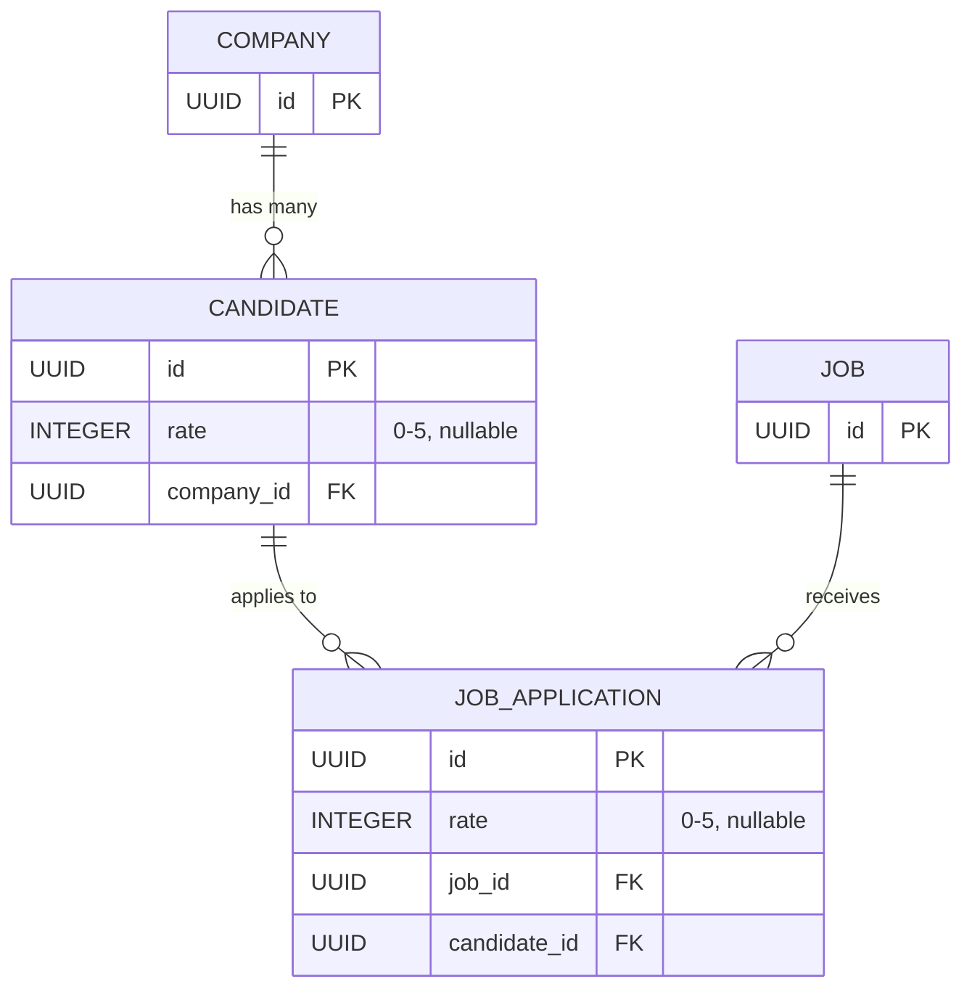
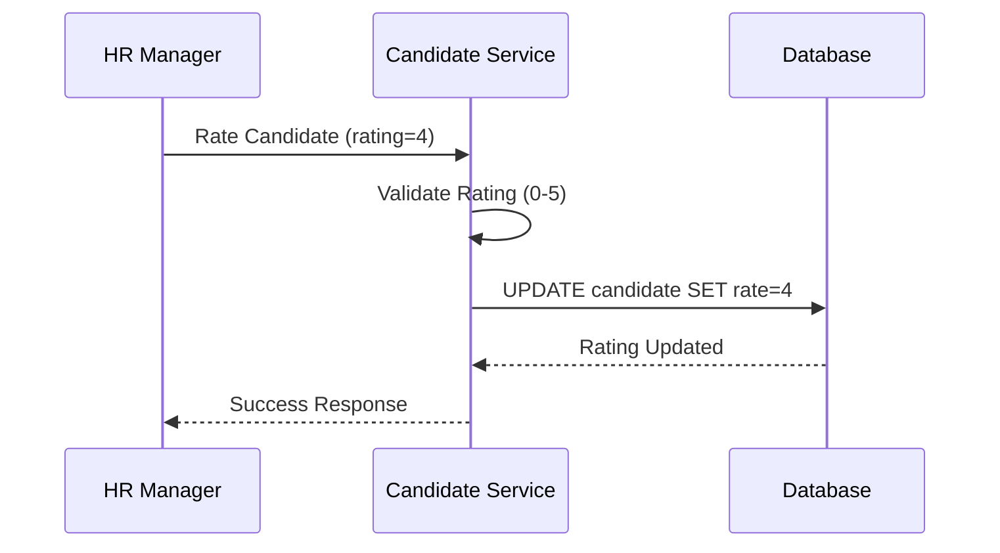
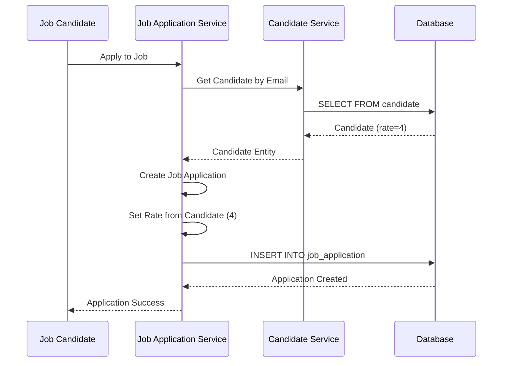
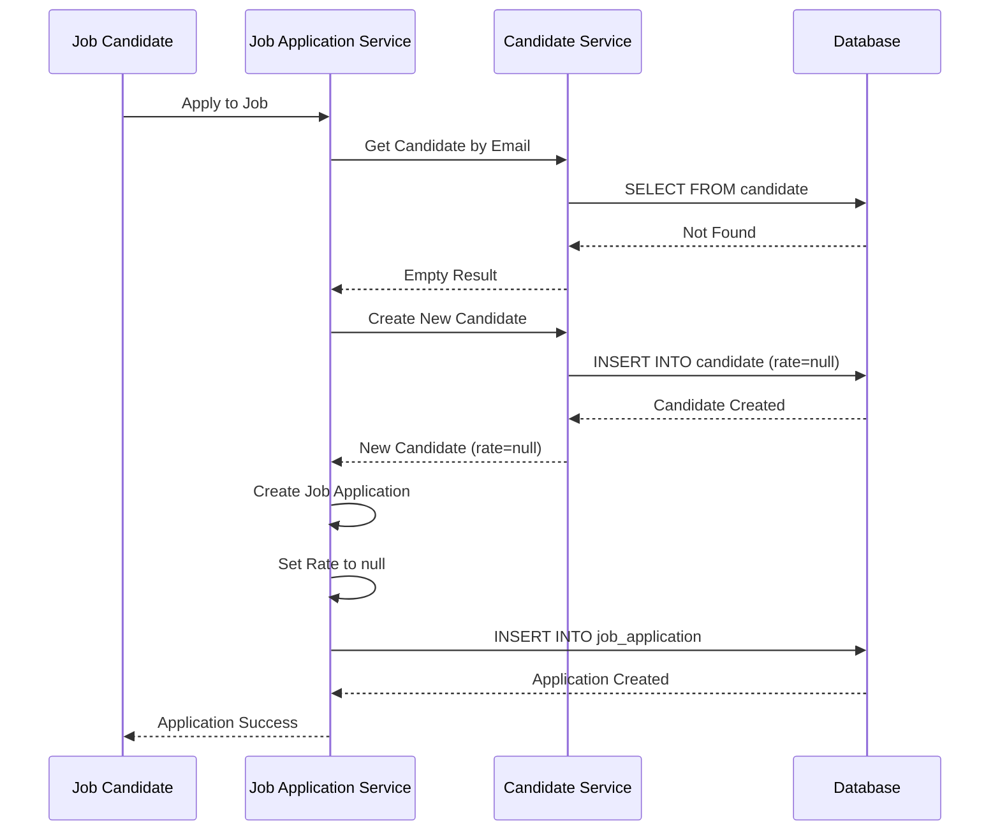

# Candidate and Job Application Rating System Documentation

## Overview

The Job Posting Application implements a comprehensive rating system that allows companies to evaluate and track candidate performance across job applications. This system provides a standardized way to assess candidates and maintain historical rating data for better hiring decisions.

## Table of Contents

1. [System Architecture](#system-architecture)
2. [Database Entity Diagram](#database-entity-diagram)
3. [Rating Scale](#rating-scale)
4. [Sequence Diagrams](#sequence-diagrams)
5. [API Usage](#api-usage)
6. [Business Rules](#business-rules)
7. [Monitoring and Observability](#monitoring-and-observability)
8. [Troubleshooting](#troubleshooting)

## System Architecture

The rating system consists of two main components:

### 1. Candidate Rating
- **Purpose**: Store the overall rating for a candidate within a company
- **Scope**: Company-specific (candidates can have different ratings in different companies)
- **Persistence**: Stored in the `candidate` table
- **Lifecycle**: Can be updated throughout the candidate's relationship with the company

### 2. Job Application Rating
- **Purpose**: Capture the candidate's rating at the time of job application
- **Scope**: Specific to each job application
- **Persistence**: Stored in the `job_application` table
- **Lifecycle**: Set once during application creation, remains immutable

## Database Entity Diagram



### Key Relationships:
- **Company** (1) ←→ (N) **Candidate**: One company can have multiple candidates
- **Candidate** (1) ←→ (N) **JobApplication**: One candidate can have multiple job applications
- **Job** (1) ←→ (N) **JobApplication**: One job can have multiple applications

## Rating Scale

The system uses a **5-point rating scale**:

| Rating | Description | Interpretation |
|--------|-------------|----------------|
| **0** | Not Rated | No rating assigned yet |
| **1** | Poor | Below expectations |
| **2** | Fair | Meets minimum requirements |
| **3** | Good | Meets expectations |
| **4** | Very Good | Exceeds expectations |
| **5** | Excellent | Outstanding performance |

### Key Characteristics:
- **Range**: 0-5 (inclusive)
- **Type**: Integer
- **Nullable**: Yes (allows for unrated candidates/applications)
- **Default**: `null` (no rating assigned)

## Sequence Diagrams

### 1. Candidate Rating Assignment



### 2. Job Application Rating Assignment



### 3. New Candidate Application Flow




## API Usage

### Updating Candidate Rating

```http
PUT /api/candidates/{candidateId}
Content-Type: application/json

{
  "firstname": "John",
  "lastname": "Doe",
  "email": "john.doe@example.com",
  "rate": 4,  // Set candidate rating
  "active": true,
  "blocked": false
}
```

### Retrieving Candidate with Rating

```http
GET /api/candidates/{candidateId}
```

Response:
```json
{
  "id": "123e4567-e89b-12d3-a456-426614174000",
  "firstname": "John",
  "lastname": "Doe",
  "email": "john.doe@example.com",
  "rate": 4,  // Current candidate rating
  "active": true,
  "blocked": false,
  "createdDate": "2025-01-15T10:30:00Z"
}
```

### Job Application with Rating

```http
GET /api/job-applications/{applicationId}
```

Response:
```json
{
  "id": "456e7890-e89b-12d3-a456-426614174001",
  "firstname": "John",
  "lastname": "Doe",
  "email": "john.doe@example.com",
  "rate": 4,  // Rating at time of application
  "jobId": "789e0123-e89b-12d3-a456-426614174002",
  "candidateId": "123e4567-e89b-12d3-a456-426614174000",
  "relevance": 85.5,
  "createdDate": "2025-01-15T11:00:00Z"
}
```

## Business Rules

### 1. Rating Validation
- **Range**: Must be between 0 and 5 (inclusive)
- **Type**: Integer only
- **Nullable**: Yes (allows unrated candidates/applications)

### 2. Candidate Rating Rules
- **Scope**: Company-specific (same candidate can have different ratings in different companies)
- **Updateable**: Yes, can be changed at any time
- **Default**: `null` (no rating assigned)

### 3. Job Application Rating Rules
- **Source**: Always copied from candidate's current rating at application time
- **Immutable**: Once set, cannot be changed
- **Fallback**: `null` if candidate has no rating or is new

### 4. Rating Assignment Logic
```java
// During job application creation
if (existingCandidate.isPresent()) {
    jobApplication.setRate(existingCandidate.get().getRate());
} else {
    jobApplication.setRate(null);  // New candidate, no rating
}
```


## Troubleshooting

### Common Issues

1. **Rating Not Assigned to Job Application**
   - Check if candidate exists in the system
   - Verify candidate has a rating assigned
   - Check application creation logs

2. **Invalid Rating Values**
   - Ensure rating is between 0-5
   - Check for null handling in client code
   - Verify database constraints

3. **Performance Issues with Rating Queries**
   - Add database indexes on `rate` columns
   - Optimize queries with proper WHERE clauses
   - Consider pagination for large result sets

### Debugging Queries

```sql
-- Check for invalid ratings
SELECT * FROM job.candidate WHERE rate < 0 OR rate > 5;
SELECT * FROM job.job_application WHERE rate < 0 OR rate > 5;

-- Find applications without ratings
SELECT * FROM job.job_application WHERE rate IS NULL;

-- Check rating distribution
SELECT rate, COUNT(*) as count 
FROM job.candidate 
WHERE rate IS NOT NULL 
GROUP BY rate 
ORDER BY rate;
```


## Monitoring and Observability

### Key Metrics to Monitor

1. **Rating Distribution**
   ```sql
   SELECT rate, COUNT(*) as count 
   FROM job.candidate 
   WHERE rate IS NOT NULL 
   GROUP BY rate 
   ORDER BY rate;
   ```

2. **Applications Without Ratings**
   ```sql
   SELECT COUNT(*) as unrated_applications
   FROM job.job_application 
   WHERE rate IS NULL;
   ```

3. **Rating Assignment Success Rate**
   ```sql
   SELECT 
     COUNT(CASE WHEN ja.rate IS NOT NULL THEN 1 END) as rated_applications,
     COUNT(*) as total_applications,
     (COUNT(CASE WHEN ja.rate IS NOT NULL THEN 1 END) * 100.0 / COUNT(*)) as success_rate
   FROM job.job_application ja;
   ```


---

This documentation provides a comprehensive overview of the rating system implementation. For technical details, refer to the source code and API documentation.

## Quick Reference

### Rating Scale
- **0**: Not Rated
- **1**: Poor
- **2**: Fair  
- **3**: Good
- **4**: Very Good
- **5**: Excellent

### Key Points
- ✅ Ratings are company-specific
- ✅ Job application ratings are immutable snapshots
- ✅ New candidates start with `null` rating
- ✅ Rating assignment happens asynchronously
- ✅ All ratings are nullable (0-5 range when set)
